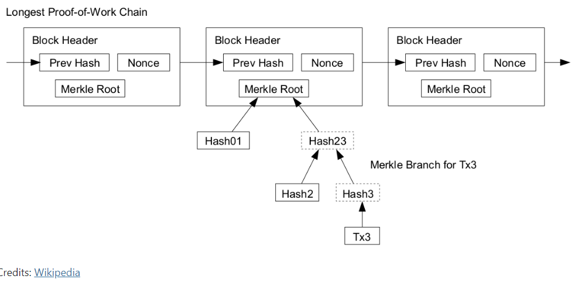
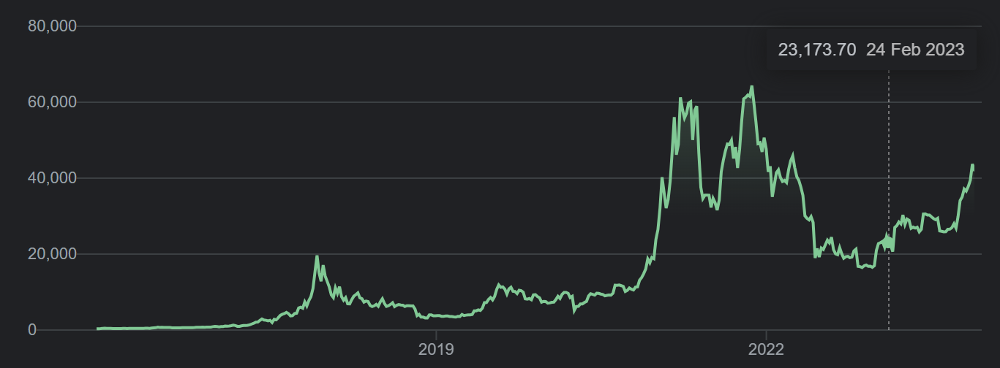
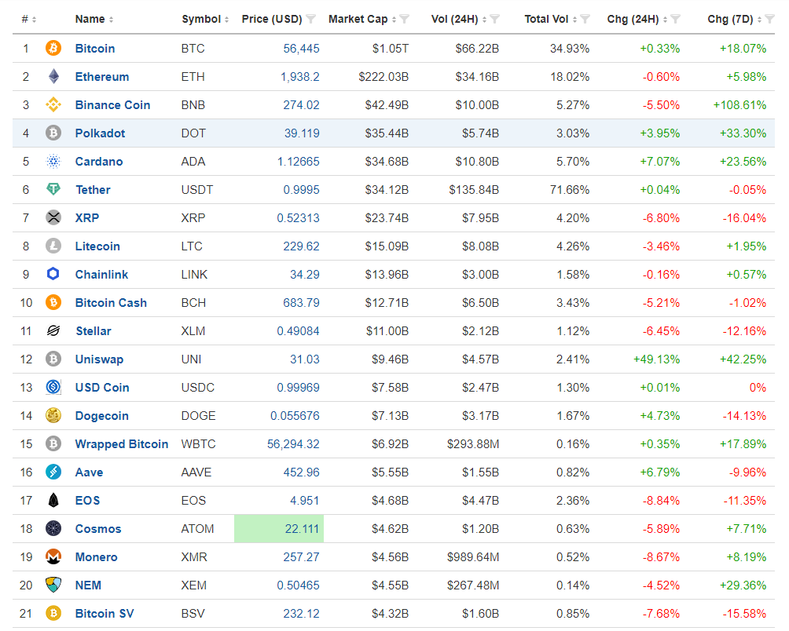
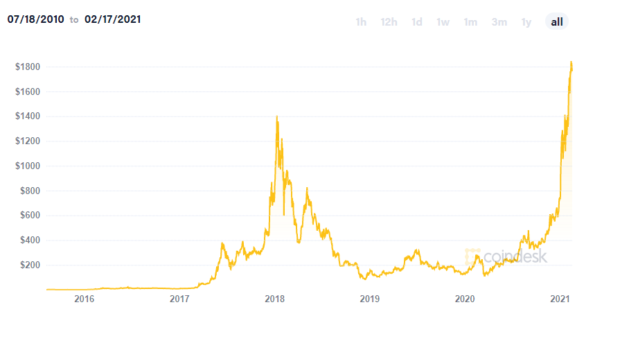
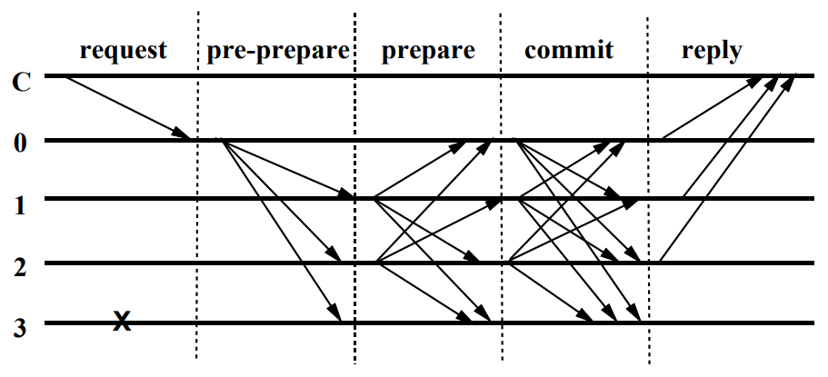
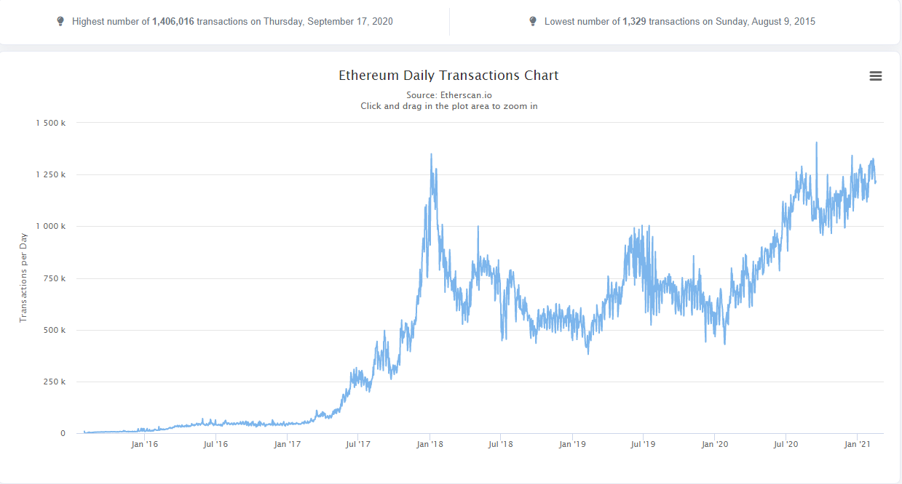
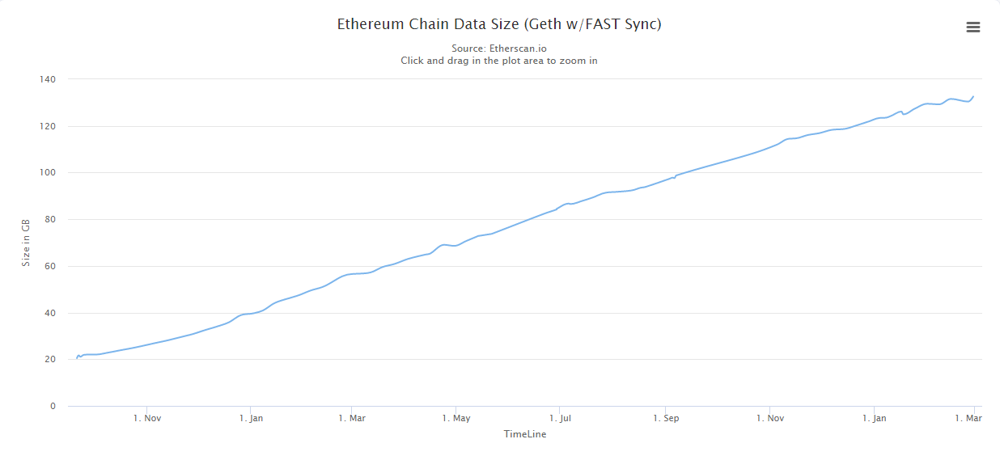
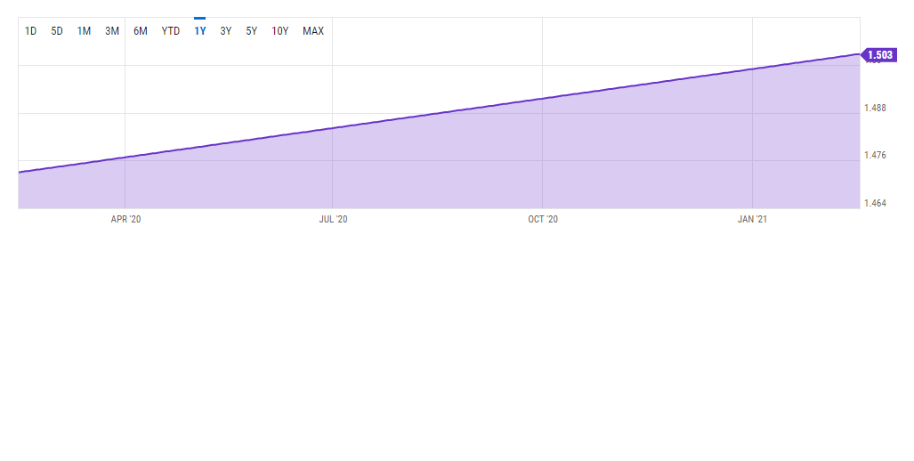

# Chapter 1. 블록체인의 이해

블록체인이 비트코인에서 유래되었고, 블록이 무엇이고, 어떻게 블록체인으로 연결되는지 설명할 수 있게 된다. 분산시스템에 어떤 장애가 발생할 수 있으며, 합의를 통해 신뢰할 수 있는 상태로 만들 수 있는지, 합의방식인 작업증명 PoW, 지분증명 PoS을 설명할 수 있게 된다. 블록체인이 어떤 분야에 적용할 수 있는지, 현재 처리속도가 느리고, 저장용량이 증가한다는 문제가 있는데 이를 어떻게 풀어갈 것인지 이해하게 된다.

# 1. 블록체인에 대한 관심

골드러시! 때 아닌 골드러시라고 심드렁하게 말하겠지만, 21세기에 디지털골드가 나타났다고 한다. 디지털 시대에 금 역할을 할 것이라는 거창한 약속과 함께.

암호화폐에 대한 보도가 늘어나면서, 이제 누구라도 한 번은 들어보았을 것이다. 처음에는 일부 극소수만 알고 있다가, 이제는 누가 말해도 이상하지 않을 정도로 알려지고 있다.

뉴스 보도량만 봐도 그렇다. 비트코인 가격이 올랐다는 등 암호화폐와 관련하여 보도가 늘어나고 있고, 이를 반증하듯이 구글 트랜드를 보면 2018년 비트코인이나 블록체인에 대한 검색이 급격하게 증가했다는 것을 볼 수 있다. 암호화폐에 대한 투자, 즉 비트코인의 가격이 오르고 내리는 정도에 따라 검색량이 등락을 하고 있다.

여러 통계를 보면, 블록체인 시장은 급격히 늘어가는 것으로 보인다. 가트너는 2025년 1760억달러, 2030년에는 폭발적으로 증가해 3조 1천억달러에 이를것이라고 전망하고 있다. 미국이 전체의 40%를 지출, 서유럽, 중국, 아시아태평양 (일본 제외) 순서로 뒤따를 것으로 예상했다.

블록체인은 내재한 암호화폐를 통해 지급결제 플랫폼으로 유용성이 있지만, 확산되는 단계로 진입할지 아직은 두고 볼 일이다.


# 2. 블록체인

## 2.1 블록체인이란?

### 블록체인은 거래 데이터와 해시값으로 구성된 블록들의 연결

우선 '블록체인'이라는 단어부터 이해해 보자.
'블록체인'이라는 단어의 뜻 그대로 보자면, 이는 블록이 체인(chain)처럼 연결된 것을 의미한다.
즉 블록체인은 블록의 묶음인 것이다.

그렇다면 블록은 무엇일까? 블록은 거래의 묶음이다.
그냥 물건을 매듯이 하는 것이 아니라, **해시 기법이라는 암호화 방법을 이용해서 묶어 놓은 것**이다. 거래는 또 무엇이란 말인가? 주문, 송금 또는 예금, 모두 거래에 해당한다. 이러한 거래들은 은행에서 컴퓨터 서버를 이용해서 기록되는 것이 일반적이다. 그러나 블록체인에서는 이러한 거래 내역을 블록에 저장한다.

뿐만 아니라 그러한 거래 내역들을 해시 기법을 이용해서 암호화 한다.
이렇게 암호화된 거래 내역들은 다음 그림에서 보듯이 쌍(pair)으로 묶여 요약본 형태로 해시화된다. 이렇게 해시화된 것들을 또 쌍으로 묶어 해시화시키는 작업을 계속해서 최상단 해시값만 남을 때까지 반복한다. 마지막으로 남은 해시값은 머클 루트(Merkle Root)라고 부르고, 이는 블록에 있는 모든 거래 내역의 요약본에 해당된다. 비유를 하면, **굴비 꾸러미를 하나씩 엮어서 생긴 맨 윗 매듭이 '머클루트'**이다. 

좀 더 기술적으로 정리하면, 그림의 아래 부분 트리의 리프 노드(leaf node)인 거래 Tx3을 해싱해서 Hash3을 만든다. Hash3는 다른 거래 내역 Tx2를 해싱한 Hash2와 묶여서 다시 해시화되고, 새로운 값인 Hash23를 만들어낸다. 이런 방식으로 거래를 하나씩 계층적으로 서로 묶어서 모든 거래의 해싱이 완성되고 최상단 노드의 해시 값이 '머클루트'가 된다.

이렇게 암호화 해놓으면 어떤 장점이 있는 것일까? 누군가 블록에 포함된 거래 정보를 수정하는 시도가 있다면, 해시값이 달라지고, 결국 꾸러미가 틀어지게 된다. 그런데 참여자 노드들은 동일한 데이터 블록들을 공유하고 있기 때문에 특정 노드의 블록이 잘못되었다면, 다른 노드들에 있는 해시값을 비교해서 잘못된 것을 쉽게 찾아낼 수 있다. 이러한 특징때문에 블록체인은 일단 기록이 되면 수정이 아예 불가능하게 된다.

이와 같이 거래데이터가 쌓이면 블록이 되는 것이고, 또 블록을 해시로 연결해서 블록체인으로 만들게 된다.
블록이 모여서 완성이 되면, 블록은 자신을 유일하게 식별해 주는 해시 값을 가지게 된다. 이와 같이 블록들은 서로 앞 블록의 식별자 '해시 포인터 hash pointer'를 가지고 있는 방식으로 연결되며, 이를 암호화해서 누구나 쉽게 알지 못하도록 하고 있다.

> 더 알아보기: 해시값

> 데이터를을 특정 해시 공식에 따라 암호화하는 기법이다. 블록체인에서는 sha256이라고 알려진 방법으로 데이터의 크기에 관계없이 항상 64바이트의 해시값을 생성한다. 예를 들어 \"나는 모모은행에 200원을 입금했다\"는 거래 정보를 해시값으로 생성하면 \"63add0f99dfdf453b20658ebf8fd33702d3c01f32bc51e8ee978dc8374ab6355\"이 된다. 그런데 거래 정보를 \"나는 모모은행에 201원을 입금했다\"로 변경하면 해시값은 \"6818a4380113396112fd8740cbf2d51dd463cab03950c5d1b7e5d3ecb9d80796\"가 된다. 이렇게 숫자 한 개만 바뀌었을 뿐인데도 해시값은 완전히 다른 값이 만들어진다. 블록체인의 중요한 기법이므로, 뒤에 자세히 설명하게 된다.



#### 블록체인은 수정불가능한 분산원장

블록체인은 데이터들이 들어있는 블록들을 인터넷상에서 서로 연결(chain)하여, 중앙 집중 서버 없이 데이터를 기록, 인증, 보존, 관리하는 디지털 장부로서 **분산원장기술** (DLT, Distributed Legder Technology)을 의미한다. 하지만 이렇게 서버 없이 데이터를 기록하고 관리한다고 많은 사람들이 관심을 기울이지는 않을 것이다. 블록체인 기술은 다수의 참여자들이 정보를 변조하기 어렵도록 공유함으로써 데이터를 기록하고 보존하며, 관리하는 기술이다. 여기서 중요한 부분은 데이터를 변조하기 어렵다는 점이다.

블록은 거래 데이터들이 기록되어 있는 거래 원장이다. 쉽게 생각하면, 거래 원장은 모든 거래 내용들을 기록해놓은 장부라고 생각할 수 있다. 그런데 이러한 데이터들이 아무렇게나 저장되어 있다면, 남들이 쉽게 수정할 수 있다는 문제가 있다. 그래서 블록의 데이터들은 **해시 기법이라는 암호화 방법을 이용해서 처리**되어 있다. 그리고 이렇게 생성된 해시 값은 블록에 데이터와 함께 저장된다. 해시 기법은 데이터의 내용을 이용해서 처리하기 때문에, 블록에 포함된 거래 정보를 단 한글자라도 수정한다면, 해시값이 달라지고, 결국 수정되었음을 알 수 있다. 즉 거래를 암호화하며, 수정이 불가능하도록 하고 발생한 거래를 누구나 볼 수 있도록 적어놓은 원장, 그래서 공개된 분산원장, Distributed Ledger라고 한다.

이렇게 연결되어 있는 블록들은 기존 클라이언트/서버 구조의 중앙 집중형 서버없이 블록체인에 참여하는 노드(참여자)간에 P2P 형태(1:1형태의 컴퓨터간 직접 통신 방법)들에 복제되어 저장되기 때문에, 중앙 서버가 해킹되면 데이터가 조작될 수 있는 보안 문제가 발생하지 않는다. 또한 분산시스템에서는 **합의 알고리즘을 통해 거래를 인증**하고, 블록체인에 기록한다. 이 기록은 중앙에서 통제되는 것이 아니라, 참여하는 모든 컴퓨터에 **분산되어 동기화**된다.
따라서 거래가 인증되고 쓰여지고 나면 **수정될 수 없는**, 영원히 지워지지 않는 특성을 가진다. 즉 블록체인의 데이터는 네트워크 환경에 연결되어 있는 분산된 컴퓨터들에 데이터가 저장되어 있어, 아무나 임의대로 수정할 수 없고, 반대로 누구라도 조회할 수 있다는 장점이 있다. 이러한 점 때문에 기록에 대한 '신뢰'가 매우 높고, 이러한 신뢰를 필요로 하는 여러 산업군에서 관심을 가지고 있다.

#### 블록체인은 프로그램이 가능한 컴퓨터이다.

그런데 왜 이처럼 단순한 데이터의 연결에 불과한 블록체인이 관심을 받는 것일까? 그 이유는 분산 컴퓨팅이다. 블록체인은 암호화폐인 비트코인에 내장되어 있는 기술이다. 최초의 암호화폐로 알려진 비트코인의 블록체인은 프로그래밍이 가능한 매체가 아니었기 때문에, 뭔가 비지니스 서비스를 제공하려 해도 불가능한 수준이었다. 이는 해당 블록체인 기술이 비트코인을 위해서만 만들어졌기 때문이었다. 하지만 암호화폐 기술 중에는 프로그래머가 직접 코드를 작성해서 배포하고 실행할 수도 있다. 이러한 블록체인에서 동작하는 프로그램을 스마트 컨트랙(smart contract)이라고 한다.

블록체인에는 우리가 프로그램을 하듯 스마트컨트랙을 만들어 배포해 놓을 수 있을 뿐만 아니라
발생하는 트랙잭션이 기록되기도 한다. 따라서 프로그밍이 가능한 분산 데이터베이스라고 볼 수 있다.

블록체인 기술이 암호화폐를 내장한 플랫폼에서 발전하여 금융거래만 기록할 수 있다고 오해할 수 있지만, 블록체인 기술은 사실 가치있는 모든 **경제적 거래를 프로그래밍하여 기록**할 수 있다. 블록체인을 그냥 단순하게 줄여서 하나의 컴퓨터라고 생각해도 무리가 없다. 단 우리가 쓰고 있는 개인용 컴퓨터와는 다른 분산컴퓨터라고 생각해야 한다. 따라서 프로그래밍하는 방법도 기존 방식과는 다를 수밖에 없다. 

이 책에서는 이더리움(etherium)이라는 암호화폐에서 사용하는 블록체인 기술을 이용해서 프로그램을 개발하고 배포하는 것을 학습한다. 

## 2.2 마이닝
암호화폐에서 '마이닝한다'는 말이 쓰인다. 설마 채굴하는 장면을 연상하지는 말자. 마이닝이란 다름 아닌 **거래를 인증하는 과정**을 말한다.

비트코인은 금전거래가 발생하면 거래기록을 블록으로 만든다. 네트워크 노드(peers)는 그 블록을 인증하기 위해 마이닝이 수행된다. 약 10분쯤 걸린다. 인증된 거래는 블록체인에 붙이고 실시간으로 공유된다.
특정 기관이 거래를 인증하는 것이 아니라, 누구나 인증에 참여할 수 있다. 여러 참여자 가운데 실제 인증을 하게 되는 참여자는 그 노력에 대해 보상을 받게 된다.
이 과정을 마이닝이라고 한다.

참여자는 컴퓨터이고, 금액과 거래는 디지털화 되어 있다. 기존 종이 화폐가 사용되지 않는다.
또한 그 처리비용도 기존 신용거래 또는 금전거래의 수수료보다 저렴하다.
그러니까 **마이닝이 끝났다는 말은 그 트랜잭션이 인증되었고, 블록체인에 기록**된다는 말이다.

마이닝을 하는 과정은 해시 값을 생성하는 계산능력, **hashrate**에 의해 결정되는데 더 강력한 컴퓨팅 파워를 가지면 마이닝을 보다 빠르게 할 수 있다.
FPGA (Field-programmable gate array), ASIC (Application-specific integrated circuit) 같은 기계를 활용하기도 한다.

최근 중국정부가 중국 정부가 암호화폐와 코인공개상장(ICO) 불허뿐만 아니라 채굴업을 단속하는 등 제한적 입장을 취하고 있다.
중국 정부의 암호화폐 활동 금지 조치가 지속되고 있지만, 블록체인 기술은 발전시키겠다는 입장 역시 고수하고 있고, 시진핑 중국 주석은 블록체인을 획기적인 기술이라고 발언한 바 있다.

## 2.3 플랫폼으로서의 블록체인

잘 알려진 투자자 워런 버핏 Warren Buffett은 비트코인은 비트코인은 망상 delusion이라고 했다. 심지어는 "Rat Poison Squared"라는 정말로 쥐약이라는 표현을 했지만 블록체인은 유망한 기술이라고 말했다.

새삼 우리가 주목하는 것도 비트코인에 내재하는 블록체인 기술이다.
화폐라는 매우 중요한, 실수가 허용되지 않는 금융기록을 블록체인에 전송하고, 기록하는 기술이 중요하다.
기존에 존재하는 암호, 머클트리, P2P 기술을 영리하게 조합하여 창의적인 화폐로 만들었고 플랫폼으로 받아들여지고 있다.
HTTP가 문자정보의 인터넷 프로토콜이라면, Cryptocurrency는 금융프로토콜으로서 지급결제 플랫폼이다.
플랫폼으로서 합의, 보안, 통신 기술을 내포하고 있다.

* **합의** 계층: 블록을 생성한 후 체인으로 연결해 가기 위해 합의가 필요하다. 앞서 살펴본 바와 같이 합의가 되어야 비로서 정당한 블록으로 인정된다. 암호화폐 별로 적용되는 합의알고리듬은 서로 다르게 고안되어 적용될 수 있다.

* **보안** 계층: 블록체인에서의 데이터는 위변조를 막기 위해 암호기술을 적용한다. 트랜잭션은 발생하면 디지털서명을 하고, 수신측에서 진본인지 인증할 수 있다. 또한 블록은 해시로 암호화하고 이를 통해 서로 연결해 놓고, 데이터가 변경되면 해시들이 연쇄적으로 변경되어야 하는 구조라서 튼튼할 수 밖에 없다.

* **통신** 계층: 트랜잭션이 발생하면 P2P 상에 전파가 되고, 블록체인의 동기화가 이루어 진다.

# 3. 비트코인

블록체인은 어느 날 한 순간에 생겨난 것이 결코 아니다. 비트코인에 내재되어 있는 기술로서, 비트코인과 더불어 이미 사용되어 오고 있는 현상이다.
비트코인에서는 발생하는 거래를 기록하고, 쌓아서 블록으로, 그리고 블록들을 체인으로 연결해 놓고 있다.
그렇다면 비트코인은 또 어디서 갑자기 튀어나온 기술일까?

## 3.1 비트코인 이전의 암호화폐들

암호화폐는 최근에 관심을 끌어서 그렇지 생각만큼 그렇게 젊은 기술은 아니다.

* 1982년 David Chaum이 당시 30세도 되지 않은 젊은 나이에 **Digital Cash**를 처음으로 고안하였다. 여기에서 **blind signature**라는 현재의 디지털서명과 유사한 기법을 사용했다.
원본은 노출하지 않고 (blinded), 서명하고 나면 나중에 공개된 방식으로 원본과 비교하여 인증할 수 있게 된다.
종이문서로 비유하면, 문서가 봉투에 들어 있고 봉투에 서명하면 먹지가 되어 있어, 봉투 안의 문서에도 먹지에 사인이 베껴지도록 하는 것이다.
따라서 봉투에서 문서를 꺼내도 문서에는 서명이 남아 있게 된다.
RSA와 같은 디지털서명도 원본을 해싱해서 못보게 하고, 키를 사용해서 서명한다는 점에서 거의 다르지 않다.

* 1997년 Adam Back이 자신의 논문 "Hashcash - A Denial of Service Counter-Measure"에서 Hashcash를 제안했다. 메일 전송자가 일정 CPU 시간을 투입해서 우표와 같은 것을 (실제로는 Hashcash 문자) 이메일 헤더에 첨부하고, 이메일 수신자는 이를 확인한다. 하나씩은 적은 노력(비용)이라 해도, 대량을 발송하는 경우에는 합산을 하면 지불이 과도하게 된다. 이러한 방식으로 이메일 스팸이나 DDoS 공격, 거래거부공격 distributed denial-of-service attack을 막을 수 있다고 주장했다.

* 1998년 Wei Dai가 b-money 익명 분산전자화폐를 제안했다. 화폐발행은 작업증명 PoW (Proof-of-Work)에 대한 hashcash 투입된 비용만큼 산출되었다. 작동방식이 비트코인과 유사했다. 이더리움의 제일 적은 단위 wei는 이 기술을 제안한 이름에서 유래가 되었다고 한다.

* 2004년 Hal Finney는 비트코인에 앞서 작업증명 PoW를 고안했고, 2009년 1월 비트코인의 첫 거래를 받았다고 한다. 역시 Finney라는 이더리움의 화폐단위도 여기서 그 유래를 짐작할 수 있다.

* 2008년 비트코인이 태어난다. 비트코인은 Satoshi Nakamoto가 제안한 디지털화폐, 2009년 1월 3일 block 0을 마이닝하면서 처음 발행, 2009년 2월 11일 Bitcoin Core v0.1 프로그램이 공개된다. 비트코인은 기존에 있는 기술을 창의적으로 조합해 고안되었다. 암호 서명, PoW 등도 이미 나와 있는 기술이었다. Satoshi도 b-money를 참조했다고 밝힌적 있다.

## 3.2 비트코인은 화폐로서 기능하는가

비트코인을 비롯한 블록체인 기반의 암호화폐는 **중앙은행이 개입하지 않아도 개인들이 자유롭게 입출금, 송금 등의 금융거래**를 할 수 있다.
금융거래는 **디지털서명**을 적용하여 보안을 철저히 하고, 
은행이 그 거래를 독점하지 않고 사용자들이 **분산하여 저장**하기 때문에 위변조 또는 해킹이 사실상 불가능하다.

우리가 사용하는 화폐는 정부에서 발행하고 실물로 존재하지만 비트코인은 알고리즘에 따라 발행이 되고, 유통이 된다. 실물 화폐는 필요에 따라 정부가 더 발행할 수 있지만, 비트코인은 발행량이 한정되어 있다. 현재는 약 1750만 개 정도가 발행되었으며 (2019년 3월 5일 기준), 앞으로 350만 개가 더 발행될 예정이다.

화폐는 가치의 척도, 가치의 저장수단, 교환 수단으로서 기능한다고 한다.
비트코인이 화폐로서 기능하는지, 그 적격성에 대해서는 아직 의문이 남아있다.

블룸버그가 보도한 미국 블록체인 연구기관 Chainalysis에 따르면 2019년 첫 4개월간 비트코인 거래 중 1.3%만이 실제 상거래에 활용됐다.
아직까지는 98% 이상이 거래소에서만 돌고 있다는 얘기다.

비트코인은 투자대상으로서 인식되고 있는 듯하다.
2018년 갑자기 비트코인에 대한 관심이 증가하면서 그에 따라 가격도 급등락하고 있다. 
그 관심은 투자대상으로서 비트코인 가격에 고스란히 반영되고 있다.
2018년 가격이 급등하면서 논란 끝에 실물가치에 대한 의심이 높아져 급락하였다.
이전에는 13달러에 머물렀지만 2017년 2만달러까지 치솟았고, 2018년에 들어서 수백달러로 폭락을 경험하였다.

비트코인이 '디지털 골드'라고 불리우더니 실제 가격도 금 값과 차이가 없었던 적도 있었다. 
2017년 12월 기준으로 2천만원을 상회하다가 2019년 4백만원으로 수직낙하하고,
그러다가 2021년에서 2022년 그 가격이 전고점을 넘어서 8천만원까지 천정부지로 솟은 바 있다.
2021년 1월 테슬라의 일론 머스크가 무려 15억 달러 (약 1조6500억원), 하나에 대략 3만 달러(약 3300만원)의 가격으로 투자하여 화제가 된 바 있다.



## 3.3 비트코인을 따르는 대안 코인들

비트코인이 성공적으로 널리 쓰이면서 많은 암호화폐가 발행되고 있다.
비트코인을 제외한 이들 암호 화폐를 대안 코인 또는 알트코인 (Alternative Coins)이라고 한다.
대개는 비트코인에서의 프레임워크를 본 따서 P2P 상에서 마이닝이 이루어지는 방식으로 구현되고 있다.

이더리움, 이더리움 클래식, 리플, 라이트코인, 에이코인, 대시, 모네로, 제트캐시, 퀀텀 등 다양한 대안코인들이 생겨났다. 비트코인은 여러 대안코인들 사이에서 일종의 기축통화 역할을 하고 있다.

최근 CBDC Central Bank Digital Currency, 중앙은행이 발행한 디지털화폐에 대해 여러 나라가 관심을 보이고 있다. 중국이 가장 적극적이고, 이미 2022년 동계올림픽에서 '디지털 위안화' (e-CNY)를 실험적으로 도입한 것으로 알려져 있다. 미국은 2020년까지만 해도 유보적인 입장이었으나, 2021년 연방준비제도 Fed가 CBDC를 검토하고 있다고 말했다. 유럽, 일본, 러시아, 터키, 싱가포르 등 세계의 80%가 CBDC 연구를 진행하고 있다 (2020년 1월 국제결제은행 BIS 보고서).

2019년 초 2500여개, 2021년 초 4500여개, 2022년 초 10,000개 규모로 코인의 발행은 늘어만 가고 있다. 현재 그 총액은 천문학적인 숫자인 1조 달러에 달하고 있다 (참조 https://www.investing.com/crypto/currencies).

1위는 비트코인이 대장주로서 전체의 대부분을, 그리고 이더리움이 다음 자리를 차지하고 있다. 이 둘을 합치면 50%가 넘는 시장을 형성하고 있다 (원화 시세 참조: https://www.bithumb.com/). 대부분의 암호화폐는 시세가 불안정하여, 시세가 어떻다고 해야 의미가 없을 정도다.

<그림 삭제??>


비트코인과 달리 블록체인에 대한 관심은 덜 하지만 만만치가 않다.
이더리움에 대한 가격도 유사한 패턴을 보이고 있지만, 아직 비트코인에 대한 가격에는 미치지 못하고 있다.



# 4. 분산 처리

블록체인이 관심을 끄는 이유는 분산환경에서 작동이 되기 때문이다.
보통 트랜잭션은 발생하면, 특정 서버가 맡아서 처리하게 된다.
블록체인은 분산이라 이와는 다르다. 어느 특정 서버가 아니라
네트워크 상에 **서로 연결된 컴퓨팅 플랫폼에 분산해서 처리**된다.
그러나 논리적으로는 하나의 플랫폼에서 처리되는 것처럼 보인다.

분산시스템은 컴퓨팅 노드(피어)들이 서로 Peer to Peer Network **P2P**를 통해 연결되고, 서버-클라이언트 역할이 고정되어 있지 않다.
서버가 중앙에 위치해서 처리하는 것이 아니라, **네트워크에 접속된 그 어떤 컴퓨터도 서버**가 될 수 있다.

중앙집중식에서는 이러한 처리가 특정 서버에 의존하는데 반해, P2P에서는 서로 자발적으로 참여한다는 점이 다르다.
어떤 노드이건 서로 동동하게 참여한다. 자신들이 **자발적으로 디스크 저장공간, 처리능력, 네트워크 능력을 제공하고 참여**한다.

원하지 않으면 스스로 참여를 하지 않아도 된다.
분산은 우리가 많이 쓰는 **비트토렌트 BitTorrent** 를 예로 들면 이해가 빠를 수 있다. 이미 오디오, 비디오, 데이터 등 디지털 파일을 분산으로 공유하고 있는 것이다.

금융에서는 **은행이 없어지고, 블록체인이 대신**할 수 있게 될 수도 있다. 이렇게 된다면 매우 혁신적이다.
송금을 할 때에도 디지털사인을 하고 지급자에게 송금하고 블록체인에 기록하면 된다.
은행을 매개로 송금할 필요가 없게 된다.

그럼에도 불구하고 거래의 위변조가 불가능하여 블록체인에 대한 기술적 신뢰가 높다. 기술적 신뢰라고 말한 것은 '심리적 신뢰'와는 조금 다르기 때문이다.

다만 정부로서는 통화에 대한 통제력이 약화되고, 과세에 대한 어려움이 예상되기 때문에 문제가 될 수 밖에 없다.

구분 | 중앙집중형 | 분산형
-------|-------|-------
서버 | 중앙에 있다 | 서버가 없다, P2P
거래 보관 | 중앙 데이터베이스 | 블록체인

# 5. 비잔틴 장군 문제

비잔틴 장군 문제는 1982년 Lamport et al. 논문에서 분산시스템에서 발생할 수 있는 합의의 어려움을 제기하고 있다 (Lamport, Shostak & Pease, 1982).
전쟁에서 적을 공격한다고 하고, 아군은 부대가 나누어져 있고 **연합**해야 이긴다고 하자.
부대를 지휘하는 장군들이 서로 **약속**을 하고 **동시에 공격**하면 된다고 하자.
문제는 각 부대를 지휘하는 장군들끼리 어떻게 공격을 합의할 것인지 이다.

얼핏 쉬워 보이지만, 풀기에는 어려운 문제이다.
부대가 서로 떨어져 있고 **전령**을 보내야만 정보를 전달한다고 하자.
그 전령이 포로로 잡힌다면 **메시지는 전달이 되지 않고** 공격은 실패하게 될 것이다.
메시지를 전달 받고 수신확인응답인 ACK를 다른 장군에게 보낼 경우 또한 포획될 수 있는 것이다.

분산시스템에 악의적인 노드가 참여할 경우 장애가 발생할 수 있다.
이러한 경우에도 신뢰할 수 있는 성능을 보여줄 수 있는지 생각해 보자.
비잔틴 문제를 좀 더 복잡하게 장군의 숫자를 늘리고, 그 중 일부가 **배신자**라고 해 보자.
메시지가 전달되었다 하더라도 믿을 수 있느냐는 문제가 있다.
배신한 장군이 있다면 그 메시지는 **위조**될 수 있다.

# 6. 합의

비잔틴의 문제에서와 같이 다수의 노드가 참여하는 분산시스템의 경우, 배신할 수 있는 노드가 있어 **정보를 위변조**할 위험이 있다.
뿐만 아니라 발신된 **정보가 유실되거나 지연**될 가능성이 있기 때문에 정확한 정보를 공유하는 것이 어렵다.
그럼에도 불구하고 분산 시스템에서는 참여하는 **노드들 간에 서로 다를 수 있는 정보를 합의를 통해 신뢰를 보장**하게 된다. 

새로운 거래가 네트워크에 전파되면, 노드들은 그 거래를 원장에 포함할지를 결정해야 한다.
이 경우 다수의 노드가 합의하면 거래를 포함하여 원장의 상태를 변경하고 합의에 이르렀다고 한다.

블록체인은 다수가 참여하지만, 그 중에는 악의적인 노드가 포함될 수 있다.
이런 경우 블록체인은 어떻게 합의를 하고 신뢰할 수 있는 상태로 만들어 나갈 것인가?

몇 가지 대표적인 합의 방식은
비잔틴장애허용 BFT, 지분증명 Proof of Stake, 위임지분증명 Delegated Proof of Stake, 권위증명 Proof of Authority, 경과시간증명 Proof of Elapsed Time 등 많은 연구가 이루어지고 있다.

## 6.1 비잔틴장애허용
비잔틴 장군문제는 정보 전달이 누락되거나 배신자에 의해 정보가 위조되면 합의에 이를 수 없고 **비잔틴 장애**가 발생한다.
이런 경우 전체가 혼란에 빠져서 실패하지 않도록 합의하는 알고리즘이 필요하다.

1999년 Castro와 Liskov에 의해 제안된 Practical Byzantine Fault Tolerance (pBFT)를 살펴보자.

1/3이 배신자이더라도 나머지 2/3가 동의하면 합의라고 가정하는 것이다.
노드 간에 서로 정보전달을 해서, 대다수 즉 2/3가 응답하기를 기다리고, 받은 모든 메시지 중 가장 많이 일치하는 데이터로 합의에 이르게 된다.
Hyperledger, Stellar, Ripple 등 블록체인에서 활용되고 있다. 이 알고리즘은 효율적이어서 블록체인이 아니더라도 활용되고 있다.

참여자들끼리 매우 빈번하게 소통하여 메시지가 위조되었거나 출처를 분명히 할 수 있다.
그러나 **노드가 늘어날수록 정보교환이 급격히 늘어**난다는 단점이 있다.

전체 장군 중 f 배신자가 있는 경우, 합의를 하려면:
* 3f + 1 만큼의 노드가 필요하고,
* 각 노드는 서로 최소 2f + 1 통신경로가 확보되어 있어야 하고
* f + 1 회 이상의 정보 교환이 있어야 한다.

합의하는 절차는 순서대로 진행된다.

- Pre-prepare 단계: 리더노드가 데이터를 보내면서 합의가 필요하다고 "pre-prepare" 메시지 전송
- Prepare 단계: "pre-prepare" 메시지를 받고, "prepare" 메시지를 다른 노드에 전송.
- Commit 단계: "prepare"  messages 받으면 "commit" 메시지를 전파. 
대다수, 즉 2/3가 모두 응답하기를 기다리고, 받은 모든 메시지 중 가장 많이 일치하는 데이터로 합의.

<그림 삭제???>


## 6.2 작업증명

PoW는 Proof of Work, **작업을 증명**한다는 의미이다.
2008년 사토시 나카모토의 논문, "비트코인: P2P 전자화폐 시스템 Bitcoin: A Peer-to-Peer Electronic Cash System"에서 소개된 합의방식이다.

**비트코인**에서 도입된 PoW를, 비트코인을 발명한 이름을 따서 **나카모토 합의**라고 한다.
이런 작업증명하는 과정을 '마이닝'이라고 한다.

"작업 증명"은 수학적 문제, 기준 해시보다 작은 값을 찾는 과정이라서 상당한 노력이 필요해서 블록체인을 적용하려면 '과연 가능할까?'라는 근본적인 한계가 지적되고 있다 (Gervais et al., 2016). 현재 이 문제에 대해 제시되고 있는 솔루션들은 대개 지분증명(Proof of Stake, PoS), 위임지분증명(Delegated Proof of Stake, DPoS) 등의 대안적 알고리즘이 제시되고 있다.

## 6.3 지분증명

PoW는 경쟁적으로 마이닝이 이루어지기 때문에 이런 컴퓨팅 파워가 낭비된다는 문제가 있다. 또한 작업증명에 걸리는 시간으로 인해 지연되는 문제를 해결하기 위해 지분증명 PoS (Proof of Stake)이 제안되고 있는데, **노드가 보유한 잔고를 기준**으로 권한을 분배하는 합의 방식이다. 예를 들면, 10%의 잔고를 가지면 10%의 블록을 생성, forge하는 권한을 부여하는 것이다. PoW에서와 같이 마이닝을 통해 블록이 생성되지 않기 때문에 채굴 보상이 주어지지는 않는다.

**PoW에서는 블록이 마이닝을 통해 생성되지만, PoS에서는 마이닝이 없다**.
단 **PoS에서는 forger가 블록을 생성하고 채굴보상 대신에 처리비용을 받게 된다**.
**Peercoin**이 2013년 PoS를 처음으로 구현했고 이더리움도 다음 버전 Casper에서 이를 예고하고 있다.

그러나 이 방식이 앞선 PoW의 단점을 모두 극복하고 분산, 성능, 보안의 목적을 모두 달성할지에 대해 논란이 있다.
이 방식에서 극단적이지만 어느 **특정 노드가 매우 잔고가 많은 부자라면 오히려 중앙화** 되는 단점이 있다.
**"Nothing At Stake"**, 즉 노드가 불량하게 행동해도 불리할 게 없다는 비판이다.

예를 들어, 여러 fork가 존재하더라도 마이닝에 따른 보상만 받으면 되기 때문에 맞는 fork인지 아닌지 마이닝하면 된다고 행동한다는 것이다.
그 결과 모든 fork를 인증하여 여러 갈래가 발생하게 되는 것이다. PoW에서는 이런 문제가 발생하지 않는다. 마이너들이 맞는 chain에 블록을 추가하면 그에 따라 보상을 받기 때문이다. PoS는 단점을 보완하기 위해 코인별로 수정하여 쓰이고 있다. Delegated PoS (Bitshares) 이더리움도 차기 버전에서 수정된 PoS를 테스트하고 있다.

# 7. 블록체인의 적용분야

비트코인에서의 블록체인은 데이터를 기록하는 저장소로 쓰였다.
블록체인 1.0이라고 하는 이 단계에서는 본래 암호화폐의 기능에 국한되어 있다면,
블록체인 2.0에서는 프로그램이 가능한 오픈 플랫폼으로 발전하고 있다.

블록체인은 누구나 사용할 수 있는 컴퓨터로서, 프로그램을 쓰고, 실행하는 플랫폼으로 진화되고 있다.
거래를 저장하는 것뿐 아니라 스마트컨트랙을 개발하고, 그 API를 사용하여 프로그램을 개발하는 것이다. 나중에 이른바 웹 3.0이라고 하는 블록체인으로 서비스를 제공하는 투표를 개발하게 된다.

또한 블록체인 스마트폰이 시장에 공개되고 있다.

국내에서는 삼성에서 **갤럭시S10**을 출시하였다. 
그 다음에 2021년 자체 두 번째 블록체인 핸드폰으로, 삼성전자가 위메이드트리와 함께 갤럭시S21 시리즈로 블록체인 휴대폰인 위믹스 폰을 출시하였다.
그 때 제공하였던 위믹스 토큰이 100배 가까이 급등하기도 해서 화제가 되기도 하였다.

2022년 미국 블록체인 개발사 솔라나가 스마트폰 사가(Saga)을 공개하고 있다.
이스라엘 스타트업인 시린랩스(Sirin Labs)가 자체 시린OS에서 작동하는 블록체인 핸드폰 **Finney**, 대만의 스마트폰 제조사인 HTC의 **엑소더스 1**, 중국 기업인 레노버와 슈가(Sugar), 창홍(Changhong), 펀디엑스 사의 **BOB, Blok on Blok** (이통사가 필요없고 휴대폰번호가 없이, 블록체인에서 전화, 문자 가능, 2020년 1월 CES에서 발표) 등이 이미 블록체인 스마트폰을 공개하고 있다.

미국의 디지털자산과 블록체인을 대표하는 Chamber of Digital Commerce는 블록체인을 활용하기 좋은 사례로서 아래를 꼽고 있다.
* 사용자 ID 분야 (Digital Identity)
* 은행, 증권 금융관련 기록
* 부동산 기록
* 유통 기록
* 자동차 보험 기록
* 의료 기록
* 암 연구결과 공유

한국에서도 블록체인 사업이 시행되고 있다.
* 공인인증서를 대체하는 블록체인기반 **뱅크사인**이 2018년 8월 개발되었고 (경쟁에 밀려 2021년 신규발급을 중단하고 금융결제원이 분산신원증명 DID인 '뱅크아이디' 출시)
* **자동차** 공유: 현대자동차는 블록체인 기술을 통해 차량 정보 기록을 직접 저장하고 관리할 계획이다. 삼성 SDS는 서울시와 함께 장안평 중고차 시장에 블록체인 기술을 도입해 차량 이력을 체계적으로 관리할 계획이다.
씨커스 블록체인은 지난 12월 31일 제주도에 소재한 타바(TABA)의 LTE 기반 렌터카 내 블록체인 결제 시스템 자산 인수를 통해 암호화폐 결제가 가능해졌다고 밝혔다 (itworld 보도, 2019.01.07).
Lazooz: Ride-sharing for collaborative transportation
* 국내에서도 **유통**이력에 블록체인 기술을 적용하였다. 원재료 조업, 수입, 공장 생산, 유통, 판매까지 데이터를 블록체인에 기록하고, QR코드만 찍으면 조업이 이뤄진 원산지, 수입 날짜, 제조 공장의 온도와 습도 이력을 볼 수 있다. (전자신문, 2018.03.12 사설 스마트물류, 블록체인 대표 모델로 육성해야). 또한 얼마 전 유명인이 투자해서 화제가 된 바 있지만, 자체 암호화폐 코인을 통해 연어를 비롯한 수산물을 국제적으로 거래하는 데 블록체인을 활용한다. 거래대금의 **결제 불이행** 또는 **연체**로 인해 수출보증보험 비용과 미수금 회수 비용이 발생하는데, 블록체인으로 **실시간 투명한 거래**로 이런 과정을 해결될 수 있다.
* **전자투표**: 과학기술정보통신부와 중앙선거관리위원회는 블록체인 기반의 온라인투표 시스템을 12월까지 개발해 2019년부터 시범서비스를 발표하였고, 또한 서울시와 경기도에서도 블록체인을 투표에 도입하고 있다. 서울시에서도블록체인 산업을 활성화하기 위한 5개년 중장기 계획 ‘블록체인 도시 서울 추진계획(2018~2022)’을 발표한 바 있다.
* 최근에는 주식거래 서비스, 실물 자산거래 서비스, 소액 결제 Micropayments, IoT 결제, 해외 결제 및 정산 서비스, 부동산 등 크라우드펀딩 등의 금융 관련 분야에서 시험되고 있다.
* 게임 또는 콘텐츠 및 공유 분야. 저작권과 같은 경우 소비자와 공급자가 직접 인증하는데 블록체인을 적용하고 있다.
* 뿐만 아니라 스팀 (https://steem.com/), e-chat(https://echat.io/), 이더리움과 IPFS 기반 akasha (https://beta.akasha.world/#/dashboard) 등 SNS도 블록체인이 활용되고 있다.

# 8. 블록체인의 문제 및 개선방안

가장 심각한 문제는 **확장성 scalability**이다. 암호화폐는 그 특성상 발행속도를 제한하고 있다. 
그림에서 보듯이 (source: https://etherscan.io/chart/tx), 하루에 많은 경우 170만 건 내외를 기록하고 있고, 이는 약 20 TPS이다 (Transactions Per Second, 초당 처리 건수는 일당처리건수를 86,400으로 나누어서 계산). 마이닝 방법이 PoS로 개선되겠지만, 비자 또는 마스터카드 처리속도가 24,000 TPS에 이르는 것과 비교하면 아직 갈 길이 멀다고 하겠다.



또한 블록체인이 2019년 130GB를 넘어서 점점 커지고 있다 (https://etherscan.io/chart2/chaindatasizefast). 
사진, 동영상 같은 콘텐츠는 용량이 커서 블록체인에 저장하게 되면 비용이 적지않게 발생하거나, 비효율적일 수 있다.
분산형 파일시스템 IPFS(Inter Planetary File System)는 파일을 저장할 때 잘게 쪼개어 네트워크에 분산하고 블록체인에는 인덱스 해시만 저장한다.
분산된 파일에는 인덱스 해시가 있어, 원본은 그 해시를 찾아서 조립하게 된다.
이러한 탈중앙화 블록체인 스토리지로는 IPFS를 포함해 sia, storj, maidsafe 등이 있다.



특정 노드가 악의적으로 거래가 완성되는 것을 방해할 수 있지만, 참여 노드 모두가 이를 지켜보지는 않는다.
참여 노드들은 지속적으로 마이닝하면서 블록을 생성해 나가기 때문에 그런 일부 노드의 악의적인 공격은 무산될 수 밖에 없다.
네트워크를 교란하기 위해 대규모 거래를 발생하게 되는 것도 비용이 비례해서 발생하기 때문에 별 의미가 없다.
**시빌 공격 Sybil attack**이란 한 사용자가 여러 노드를 통제하여 네트워크를 장악하려는 보안 위협을 말한다.
혼자지만 다수의 IP 또는 컴퓨터를 활용하거나 여러 계정을 발급하여 악의적으로 네트워크를 공격하는 것이다.
이런 공격을 통해, 예를 들면 노드의 **51%**가 동시에 악의적으로 공격을 하게 되면 블록을 자신들이 원하는 대로 변조할 수 있게 된다.

현재 PoW 기반 블록체인 확장성의 한계를 극복하기 위해 PoS와 같은 대안적 알고리듬이 제시되고 있다. 또한 **샤딩 Sharding**을 통한 온체인 방식 (first layer) 혹은 **플라즈마 사이드체인 Plasma Sidechain** 및 **라이트닝 네트워크 Lightning Network** 등의 오프체인 방식 (second layer)을 시도하고 있다.

**샤딩 Sharding**은 분할하는 기술로서, 예를 들면 지역적으로 고객DB를 분할하여 배치하는 경우를 들 수 있다.
현재는 각 노드가 블록체인을 완전히 동기화하여 최신화하고 있다.
이것은 어느 특정 노드가 데이터, 거래를 조작하지 못하게 하는 특징이기도 하다.
블록체인을 샤드로 분리하고 담당하는 노드가 있도록 구성하여 속도를 빠르게 하고, 확장성을 해결하고 있다.
이더리움은 노드에 샤드를 할당하면 해킹의 공격에 노출될 수 있으므로, 무작위로 노드를 선정하고 샤드를 할당하고 있다.
(참조: https://www.zilliqa.com/)
샤딩을 하게 되면 초당 최대 1,000 TPS를 처리할 수 있다. Vitalik은 샤딩과 2nd layer 방식을 결합하면 최대 1,000,000 TPS를 처리할 수 있다고 전망하고 있다.

**라이트닝 네트워크 Lightning network**는 블록체인에서 처리하지 않고, 결제채널을 별도로 만들어 오프체인방식으로 처리하는 것을 말한다. 사용자 간에 공동지갑을 열어, 거래를 블록체인을 경유하지 않고 실행한다. 거래가 많아도 공동지갑 내에서 일어지는 일이므로 비용이나 마이닝이 필요하지 않다. 거래가 더 이상 필요하지 않으면 잔고를 정산하고, 단일 거래로 블록체인에 기록하면 된다.

## 참고문헌
* Andreas M. Antonopoulos, Gavin Wood, 2018, Mastering Ethereum, O'Reilly
* 가사키 나가토, 시노하라 와타루, 2018, 처음 배우는 블록체인, 한빛미디어
* Castro, M., & Liskov, B. (1999, February). Practical Byzantine fault tolerance. In OSDI (Vol. 99, pp. 173-186).
* Lamport, L., Shostak, R., & Pease, M. (1982). The Byzantine generals problem. ACM Transactions on Programming Languages and Systems (TOPLAS), 4(3), 382-401.
* Gervais, A., Karame, G. O., Wüst, K., Glykantzis, V., Ritzdorf, H., & Capkun, S. (2016, October). On the security and performance of proof of work blockchains. In Proceedings of the 2016 ACM SIGSAC conference on computer and communications security (pp. 3-16). ACM.
* Towards an Agenda for Information Systems Research on Digital Currencies and Bitcoin
Smart Contracts: 12 Use Cases for Business & Beyond (2016년 12월) http://digitalchamber.org/assets/smart-contracts-12-use-cases-for-business-and-beyond.pdf

## 연습문제

문제 1. 지난 5년의 비트코인, 이더리움 가격의 변화를 알아보세요. 가격의 변동성이 왜 발생하는지 설명하세요.

설명:
나스닥에서 제공하는 암호화폐 가격을 
https://www.nasdaq.com/market-activity/cryptocurrency/
에서 살펴보자.
```
        비트코인        이더리움(년말기준)
2009년      0.003$
2010년      0.5$
2011년     10$
2012년     10$
2013년    600$
2014년    310$
2015년    360$
2016년  1,000$           7.82$
2017년 19,000$         697.79$
2018년  3,809$         133.93$
2019년 12,069$         127.91$
2020년 28,000$         731.84$
2021년 35,000$       3,710.23$
```
화폐는 가치를 가지고 있어 재화, 서비스를 구매하면서 소비되는데, 비트코인은 이러한 가치를 가지고 있다고 봐야 하는지 의문이다.
어떻게 달러화, 원화가 자고 일어나면 가격이 큰 폭으로 오르락, 내리락 한다면 어느 누가 그 화폐로 구매를 하겠는가 물어봐야 할 것이다.
그 가격이 증가하면서, 구매력이 발생하였겠지만 본질가치가 있는지에 대한 의문이 들어 가격이 급등락하고 있다.
또한 소득에 대한 과제는 어느 나라이든 필수적이다.
비트코인은 익명성인 특징으로 과세마저도 어렵다.
소득이 발생해도 정부의 과세정책을 피해 나갈 수 있다.
인류가 경험하지 못했던 형태의 디지털화폐가 어떻게 정착할지 아직도 논란의 대상이다.

문제 2. 블록체인은 블록의 연결이다. 블록은 어떻게 서로 연결되는지 설명하세요.

설명: 블록체인은 거래로 구성된 블록의 연결이고, 서로 해시 값을 트리로 연결하여 놓고 머클트리를 만들고, 이 연결을 체인이라고 이름 붙여졌다.

문제 3. 블록체인에 기록되면 수정될 수 있는지 설명하세요.

설명: 분산시스템의 문제를 풀기 위해 고안된 합의 알고리즘을 통해 거래를 인증하고, 블록체인에 기록한다.
이 기록은 중앙에서 통제되는 것이 아니라, 참여하는 모든 컴퓨터에 분산되어 동기화된다.
따라서 거래가 인증되고 쓰여지고 나면 수정될 수 없는, 영원히 지워지지 않는 특성을 가진다.

문제 4. 마이닝이란 채굴한다는 의미이지만, 암호화폐를 어떻게 채굴한다는 것인지 설명하세요.

설명: 마이닝은 거래를 인증하는 과정을 말한다.
실제 인증을 하게 되는 참여자는 그 노력에 대해 보상을 받게 된다.
이 과정을 마이닝이라고 한다.

문제 5. 블록체인은 플랫폼으로서 어떠한 계층을 가지고 있는지 설명하세요.

설명: 
* 합의계층: 올바른 블록으로 인정하기 위해 합의
* 보안계층: 위변조를 막기 위한 암호기술
* 통신계층: P2P 기반 거래 처리, 블록체인 동기화

문제 6. 암호화폐가 DDoS 공격을 막기 위해 고안이 된 적이 있다고 한다. 어떻게 가능한지 설명하세요.

설명: 
1997 Hashcash에서 메일 전송자가 일정 CPU 시간을 투입해서 우표와 같은 것을 (실제로는 hashcash 문자) 이메일 header에 첨부하고,
이메일 수신자는 이를 확인한다. 적은 노력(비용)이라 해도, 대량을 발송하는 경우 합산을 하면 지불이 과도하게 된다.

문제 7. 이더리움의 최소단위 Wei는 어디서 비롯되었는지 설명하세요.

설명: 1998 b-money를 제안한 Wei Dai의 이름에서 비롯.

문제 8. 작업증명은 비트코인에서 처음 적용이 된 기술인지 설명하세요.

설명: 아니다. 1997 Hashcash의 작업증명, 2004년 Hal Finney의 작업증명.

문제 9. 화폐는 가치의 척도, 가치의 저장수단, 교환 수단으로서 기능한다고 한다. 비트코인은 디지털골드라고 한다. 
경제가 어려울 시기에는 환금성이 있는 금에 투자를 한다. 비트코인은 금과 같은 실물은 없지만, 디지털골드라고 한다.
비트코인이 금과 같은 환금성이 있는 안전자산으로 인정받고 있는지, 비트코인이 화폐로서 기능하는지 설명하세요.

설명: 2019년 첫 4개월간 비트코인 거래 중 1.3%만이 실제 상거래에 활용되었다고 한다.
현재도 실제 상거래에 사용되기 보다는, 거래소에서 투자 또는 투기의 대상으로 여겨지고 있다.
금은 안전자산으로 인플레이션에 가격이 오르지만, 비트코인은 이번 인플레이션에 오히려 가격방어가 되지 않고 위험하다고 인식되어 가격이 떨어지고 있다.

문제 10. 대안코인들은 어떤 것들이 있는지 찾아서 시가 총액 순서대로 5개를 적어보세요.
또한 CBDC가 무엇인지 설명해보세요.

설명: 비트코인을 제외한 이들 암호 화폐를 대안 코인 또는 알트코인 (Alternative Coins)이라고 한다.
가격을 알려주는 사이트를 방문해보자 (https://kr.investing.com/crypto/)
비트코인이 물론 1위이고, 그 다음 시가총액기준을 순서대로 적으면:
- 이더리움
- Tether
- BNB
- USD Coin
- XRP

CBDC는 중앙은행이 발행한 디지털화폐이다.

문제 11. 분산시스템은 클라이언트-서버 방식과 다른지, 서버가 없는 시스템인지 설명하세요.

설명: 다르다. 어느 특정 서버에 집중하여 처리하는 것이 아니라
네트워크 상에 서로 연결된 컴퓨팅 플랫폼에 분산해서 처리한다.

문제 12. 작업증명은 어떤 작업을 했다고 확인하는 것을 의미한다. 어떤 작업을 해야 하는지 설명하세요.

설명: "작업 증명"은 수학적 문제, 기준 해시보다 작은 값을 찾는 과정, 상당한 노력이 필요하다.

문제 13. 지분증명은 작업증명의 어떤 문제를 해결하려는 시도인지 설명하세요.

설명: 컴퓨팅자원이 소모되는 것을 막고, 처리속도를 빠르게 하기 위해
노드가 보유한 잔고를 기준으로 권한을 분배하는 합의 방식

문제 14. 비트코인과 이더리움에 어떤 합의방식이 사용되고 있는지 설명하세요.

설명: 비트코인은 작업증명, 이더리움은 작업증명을 적용하다, 버전 Casper에서 지분증명을 적용한다.

문제 15. 블록체인 1.0과 2.0이라고 명명하기도 하는데, 무엇이 발전한 것인지 설명하세요.

설명: 블록체인 1.0은 암호화폐 기능에 국한.
블록체인 2.0이라는 부르고 있는 현재에는 프로그램이 가능한 오픈 플랫폼

문제 16. 2018년에 구현한 뱅크사인에 블록체인이 어떻게 적용되었는지 설명하세요.

설명: 뱅크사인은 공개키(PKI) 기반의 인증 기술이다.
비밀번호를 모두 사용한다는 점에서 외형적으로 사용자가 느끼기에 공인인증서와 큰 차이가 없어 보인다.
그러나 운영체제에 덜 의존적이어서, 아이폰 사용자들은 편리하다고 평가한다.
현재 대체적인 인증이 많이 등장하여 블록체인만의 안전성이 잘 평가받지 못하고 있는 듯하다.
그 결과 3년만에 2021년 서비스 신규발급 중단을 하였다.
금융결제원은 '뱅크아이디'를 만들었다. 기존 뱅크사인의 인증 서비스에 더해 분산신원증명(DID) 등의 기능을 더하고 있다.

문제 17. 블록체인은 은행기관 개입없이 송금이 가능하다고 한다. 어떻게 송금을 신뢰할 수 있는지 설명하세요.

설명: 송금거래의 경우, 디지털사인을 하고 지급자에게 송금하고 블록체인에 기록하면 된다.
은행을 매개로 송금하지 않는다.
블록체인의 특성 상 거래의 위변조가 불가능하여 기술적인 신뢰가 높다.

문제 18. 블록체인 핸드폰이 출시되고 있는데, 어떤 점에서 유망한지 또는 그렇지 않은지 설명하세요.

설명: 스마트폰에는 많은 스마트센서가 내장되어 있다.
다가오는 사물인터넷 환경은 분산네트워크를 적용하고, 이러한 스마트센서가 기능할 것으로 전망된다.
블록체인은 분산네트워크에서 작동하면서 노드로 참여할 수 있게 된다.
현재 디파이, NFT를 비롯하여 스마트폰에서 실행되는 디앱이 많이 등장할 수록 블록체인 핸드폰은 유망하게 될 것이다.
2021년 삼성전자가 위메이드트리와 함께 갤럭시S21 시리즈로 블록체인 휴대폰인 위믹스 폰을 자체 두 번째 핸드폰으로 출시하였다.
그 때 위믹스 토큰을 제공했는데, 당시 300원 상당에 불과했던 위믹스의 가격이 2만8천원까지 급등하기도 하였다.

문제 19. 블록체인은 시간이 가면서 크기가 증가할 수 밖에 없다. 어떤 해결방인 있는지 설명하세요.

설명: 분산형 파일시스템 'IPFS(Inter Planetary File System)'는 파일을 저장할 때 잘게 쪼개어 네트워크에 분산해서 블록체인에는 인덱스 해시만 저장한다.
분산된 파일에는 인덱스 해시가 있어, 원본은 이를 해시를 찾아서 구성하게 된다.

문제 20. 블록체인은 처리시간이 오래 걸리는 문제가 있다. 어떤 해결방안이 있는지 설명하세요.

설명: 작업증명 대신 지분증명을 적용해 처리속도를 빠르게 한다.
라이트닝 네트워크 Lightning network는 블록체인에서 처리하지 않고, 결제채널을 별도로 만들어 오프체인방식으로 처리하는 것을 말한다. 사용자 간에 공동지갑을 열어, 거래를 블록체인을 경유하지 않고 실행한다. 거래가 많아도 공동지갑 내에서 일어지는 일이므로 비용이나 마이닝이 필요하지 않다.

1.503 GB for Feb 17 2021 현재 크기이다 https://ycharts.com/indicators/ethereum_chain_full_sync_data_size




```python

```
