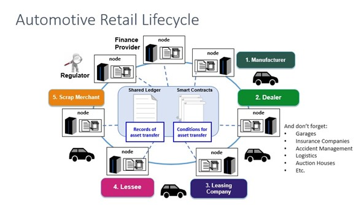
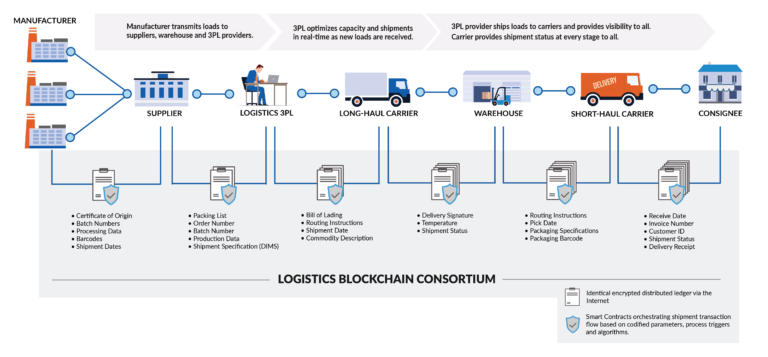
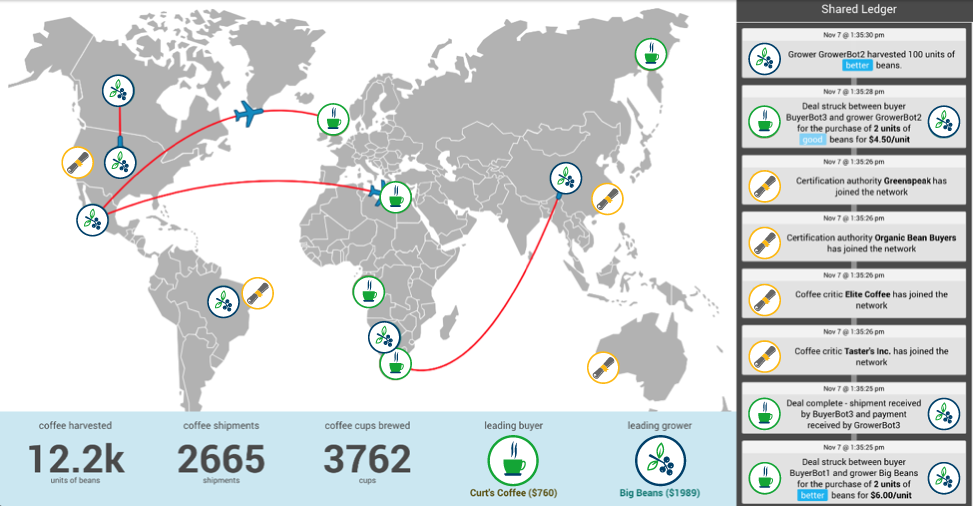
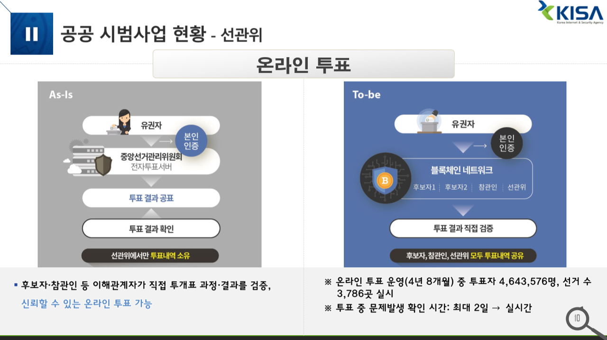
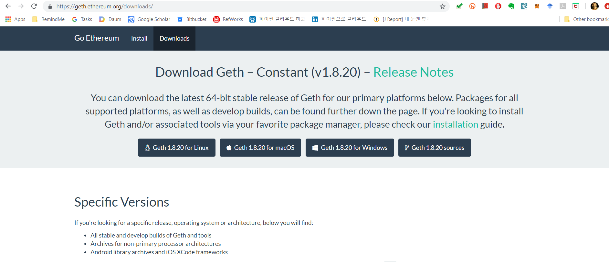
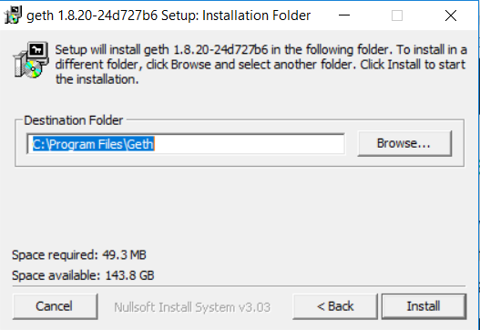
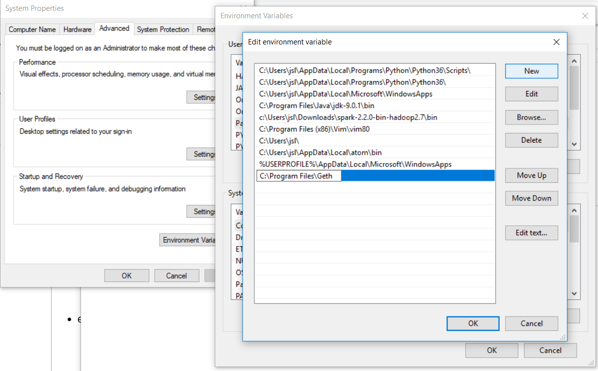
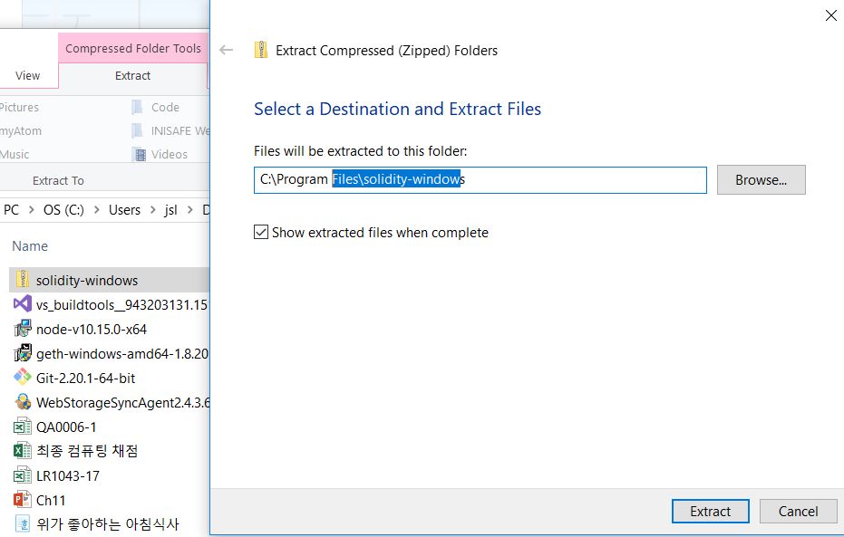
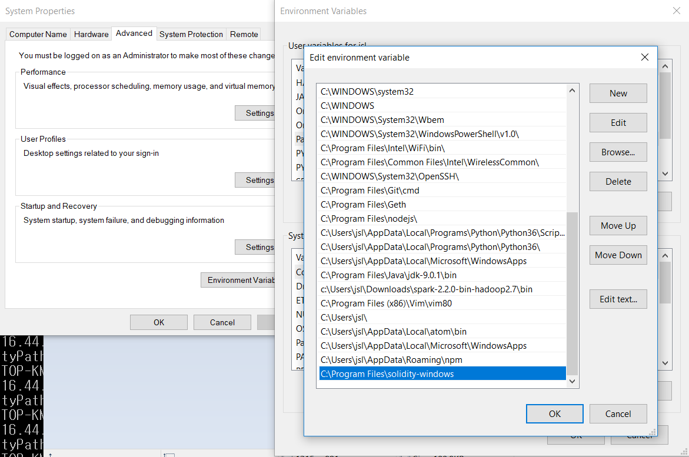

# Chapter  2. 스마트 계약

이 장에서는 스마트계약이 무엇인지 배운다. 문서 계약과 다르게, 블록체인에 작성된 디지털 형식이라서, 임의로 변경될 수 없고 그 효력을 자동으로 강제할 수 있다는 특징이 있다. 계약을 만들기 위해 이더리움 개발환경 Geth, Solidity를 설치하게 된다.

# 1. 스마트 계약이란

## 스마트 계약은 디지털 형식이다

스마트 계약(Smart Contract)은 1996년 Nick Szabo가 처음 이름을 붙이고, **디지털형식으로 명세화된 약속**으로 당사자간에 약속을 이행하는데 필요한 **절차나 규정**을 포함한다고 설명했다.

계약이란 **'쌍방의 의무나 권리에 대해 글이나 말로 약속하는 일'**을 의미하지만, 스마트 계약은 글이나 말이 아닌 **디지털** 형식이라고 강조할 필요가 있다.

게다가 블록체인에서는 문서 계약과 비교하면, 그 특성 상 임의로 변경될 수 없으며 그 효력을 자동으로 강제할 수 있다는 장점이 매력적이다.

즉, 소스코드로 작성이 되고 블록체인에 존재하기 때문에, 계약과 관련된 데이터 처리, 지급 등 수행해야할 절차가 자율적으로 실행될 수 있게 된다. **자율 실행 계약**이고 전자적으로 실행된다는 것은 **자동적**이란 의미를 내포하고 있어서, 조건에 부합되지 않아서 처리되지 않는 경우를 제외하면 중단되거나 취소될 수 없다.

## 중간거래상이 없다

또한 **중간거래상 없이 (스마트하게) 계약을 체결하고 그와 수반되는 의무를 강제**할 수 있게 한다.

금융거래, 부동산계약, 주식거래 등 어떤 화폐가치가 있는 재화 등을 거래하면서 당사자 간에 서면으로 만들어진 계약이 없어지고, 대신 **분산원장에서 만들어진다. 또한 거래의 체결, 지급 및 조건의 이행 등도 사람의 개입없이** 가능하게 된다.

## 블록체인에서의 스마트계약

스마트 계약이 처음 언급된 1996년은 블록체인이 존재하지 않던 시기였다. 2009년 비로서 비트코인이 등장하고, 비트코인 안에서의 블록체인이 진화해서 스마트계약을 실행하는 플랫폼으로 활용되고 있다.

그렇다고 비트코인이 플랫폼이라는 말은 아니다! 비트코인은 블록체인을 가지고 있지만 스마트계약을 만들 수는 없다. 비트코인은 스마트계약을 프로그래밍할 수 있는 플랫폼이 아니기 때문이다.

비트코인에서의 블록체인은 거래가 발생하면 이를 저장하고, 참여자 누구에게나 그 거래가 공유되면서 수정없는 안전한 매체인 것은 맞다. 반면 이더리움은 프로그래밍을 해서 블록체인에 스마트계약을 실행할 수 있게 되면서, 입출금 뿐만 아니라 다양한 거래를 보다 스마트하게 할 수 있게 한다.

어떻게 보면, 스마트 계약은 객체지향의 클래스와 매우 비슷하다. 스마트 계약을 컴파일하고 블록체인에 업로드하면, 분산이라는 점을 빼 놓고는 **특정 메모리의 객체**와 별 차이가 없어 보인다.

블록체인은 분산시스템에서 작동하는 특징이 있다. 계약서를 만들면 문서로 존재하는 것이 아니라 주소를 암호화 알고리듬에 따라 생성하고, 그 블록체인의 주소에 업로드 된다. 고유한 **계정**을 가지고 있는 **객체**로서, 상태 변수 및 실행 가능한 함수를 포함하여, 금융 플랫폼으로서 금액을 지급하고 받을 수 있게 된다. 그러면 블록체인 네트워크에 있는 모든 참여자가 계약을 사용할 수 있으며 거래를 계약서로 보내면 네트워크에 참여하는 각 노드에서 마이닝되고 실행된다. 그렇게 하면서 당사자 간 자동으로 거래가 체결되고 의무를 강제할 수 있게 된다.

따라서 스마트 계약은 블록체인 네트워크상에서 실행되면서, **합의프로토콜에 따라** 계약 확인, 이행 위반 등을 통합적으로 강제할 수 있으며 매우 **안전한 거래**를 보장할 수 있는 특징을 가지게 된다.

# 2. 스마트계약의 사용사례

## 자동차 사례

글로벌 자동차 회사에서 블록체인 자동차를  개발하려고 나서고 있다고 보도되고 있다.

차량 제조사(Manufacturer)에서 자동차를 생산하면, 판매 업체 Dealer로 넘어간다. 사용자에게 판매되면 타고 다니다가 폐차하거나 중고차 대리점에 되팔기도 한다. **블록체인**을 이용해 각 단계의 자동차 소유자를 등록하여 변경할 수 있다.

종이 계약은 쌍방간에 계약문건과 규정을 만들고 서명을 하여 법적인 효력을 발생한다. **종이 계약은 회사가 매개가 되어 계약이 실행**된다. 반면 스마트 계약은 프로그래밍 언어로 코딩되어 컴퓨터에서 실행한다.

보통 법적인 계약과 같지만, 필요한 입력 값을 받아, 계약에 명시된 절차에 따라 처리하고, 그 결과에 따른 행위를 수행한다.
예를 들어, **렌트회사의 중간 매개 없이** 자동차를 렌트하고 반납하는 절차를 수행할 수 있다.

 **IBM**에서는 블록체인을 활용하여 자동차 리스를 구현한 사례를 보여주고 있다.
https://github.com/IBM-Blockchain-Archive/car-lease-demo




## 물류 사례

물류는 제조사에서 고객까지 상품이 배달되면서 **많은 기관**, 발송자(shippers), DHL 같은 3PLs (Third-Party Logistics Providers), 운송인(carriers), 수탁자(consignees)가 관여될 뿐만 아니라, 이들 간에 **많은 거래가 발생하고 관련 문서가 생성**된다 선하증권(BOL-Bills Of Landing), 신용장(invoices), 배송 증명(POD-Proof Of Delivery) 등이 생성되는 문서들의 예이다. 그럼에도 불구하고 정보가 투명하게 공유되지 못하는 경우가 많다.

서로 알지 못하는 당사자끼리 거래를 성사시키려면, 중앙에서 매개하는 제 3의 기관이 필요하게 된다. 온라인쇼핑의 경우, 결제후 배송, 거래취소 등의 경우 이를 중앙기관을 믿고 신뢰해야 되지만 중간매개자 없이 거래가 완성이 된다.

출처: https://www.globaltranz.com/blog/blockchain-technology-transform-logistics/



IBM은 커피 원산지를 추적할 수 있도록 블록체인을 적용하고 있다. 블록체인이 적용되면, 농장에서 커피를 원장에 매물로 올려 놓는다. 공급망 기록은 단계별로 진행된다. 원생산자가 재배하면서 작물 상태를 기록하고, 수확하고 나면 가공업자에게 보낸다. 가공업자는 원두 세척 여부, 건조, 로스팅, 공정거래 및 유기농 여부 등을 블록체인에 기록한다.

도소매업체는 스마트계약을 실행하여 이러한 정보를 공유받아 품질, 분량, 가격을 정하여 구매한다. 블록체인은 커피콩의 유통과정을 모두 기록하고, 이 기록은 수정될 수 없기 때문에 누구나 믿고 **투명한 공급망 추적, 안전한 거래가 실행**될 수 있다. 또한 이를 통해 커피 농가의 수익 배분이 개선될 수 있다.

출처: https://developer.ibm.com/articles/cl-coffee-with-blockchain-introduction-to-how-blockchain-works/


## 투표

블록체인의 투표는 전자 투표와 달리 해킹으로 부터 안전하고, 위변조 가능성이 매우 적다.

현장 인증과 투표 용지의 기표와 달리, 블록체인 투표에서는 본인의 개인키로 인증하고, 온라인으로 기표하고 블록체인에 기록된다.
따라서 투표 결과는 선관위 뿐만 아니라, 권한이 허용된 후보자, 참관인이든 공개될 수 있다.
투표 후 거의 즉시 결과가 공표될 수 있고, 투표자 자신도 자신의 투표 결과를 확인할 수 있다.

출처: 블록체인은 우리 생활을 어떻게 바꿀 수 있을까? http://it.donga.com/28140/


# 3. 스마트계약의 플랫폼들

스마트계약을 구현할 수 있는 플랫폼이 최근 많아지고 있다.

* **이더리움**: 블록체인 시장을 주도하고 있는 플랫폼, 책에서는 이더리움을 사용한다.
* **하이퍼레저 HYPERLEDGER**는 2015년 리눅스재단에서 하이퍼레저 프로젝트 시작했고, 이더리움과 더불어 블록체인을 주도하는 컨소시엄이다. 기업에서 사용할 수 있는 표준적인 블록체인 기술을 구현하는 게 목적이고, 하위 프로젝트 5개가 모여있다 - 블록체인 익스플로러(Blockchain Explorer), 패브릭(Fabric), 이로하(Iroha), 쏘우투스 레이크(Sawtooth Lake)
* **이오에스아이오** https://eos.io/ 2017년 블록원(Block.one)에서 개발을 시작하여 2018년 6월 오픈소스로 발표했다. ICO(Initial Coin Offering) 역사 상 최대 펀드 총 41억5000만달러(원화 약 4조4630억원)를 모집하였다. PoS의 일종인 위임지분증명방식으로 구동되어, 이더리움에 비해 빠르고, 개스 사용료를 사용자가 지불하지 않고 개발자가 부담한다.

> 더 알아보기: ICO
> ICO (Initial Coin Offering)는 새로운 암호 화폐를 개발하기 위해 투자자들로부터 개발 자금을 모집하고 대신 코인을 나눠주는 것을 말한다. 주식을 상장할 때 하는 IPO Initial Public Offering와 비슷하다. IPO란 기업을 설립하고, 처음으로 외부의 투자자에게 주식을 공모하는 하는 것인데, 주식 대신 코인에 대하여 공모한다.

그 외에도 R3의 Corda, Tezos, Stellar, ConsenSys의 Quorum 등 많은 플랫폼이 제공되고 있다. 그 중에서도 대표적인 이더리움과 하이퍼레저를 비교해보자.

비트코인, 이오에스아이오를 포함해서 이더리움은 공중망에서 제공되고 있고, 반면에 하이퍼레저는 허가형 네트워크이라서 상대적으로 처리속도가 빠르다.

이더리움은 비트코인과 더불어 작업증명 합의를 사용하고 있고, 이더리움의 캐스퍼에서는 지분증명을 사용한다. 하이퍼레저는 PBFT(Practical Byzantine Fault Tolerance)를 적용하고 있다.

이더리움은 암호화폐 이더(ether)를 가지고 있지만, 하이퍼레저는 자체 통화가 없다가, 2.0에서는 패브릭 토큰이라는 발행기능이 추가되었다.

구분 | 비트코인 | 이더리움 | 하이퍼레저 패브릭
-----|-----|-----|-----
암호화폐 | 비트코인 | 이더(ether) | 자체 코인 없다 (버전2.0에서 '패브릭 토큰(FabToken)'이라는 토큰 발행 기능 추가)
네트워크 |	공중망 | 공중망이나 허가형 가능 | 허가형
합의 | 작업증명 | 작업증명 (지분증명으로 변경) | PBFT
스마트계약 | 해당 없다 | 구현 가능 (Solidity, Vyper, LLL) | 구현 가능 (chaincode)
언어 | C++ | Golang, C++, Python | Golang, Java

# 4. 이더리움

## 4.1 이더리움이 뭐지?

스마트 계약을 구현하기 위한 환경으로는 현재 이더리움이 많이 적용되고 있다.

이더리움은 블록체인 네트워크에서 스마트 계약을 생성하여 발생하는 데이터를 비트코인에서 사용하는 **블록체인에 기록할 뿐만 아니라 스마트 계약을 구현하여 실행하는 환경**을 제공한다. **프로그래밍 코드 형태의 데이터를 전송**하여 해당코드를 실행할 수 있는 오픈 플랫폼이다.

이더리움은 블록체인을 기반으로 프로그래밍 언어가 내장된 플랫폼으로 누구나 스마트 계약서 및 분산 응용 프로그램을 작성할 수 있다.

암호화폐 **이더(Ether)**라고 하는 내부에서 쓰는 화폐를 가지고 있어 금전 거래와 가스(gas)라고 하는 트랜잭션 처리 비용에 쓰이고 있다. 가스를 부담해야 하므로 불필요한 트랜잭션이 발생되는 것을 막을 수 있어 해킹 또는 악성 트래픽을 대량으로 전송하는 DDoS 공격을 예방할 수 있다.

## 4.2 비트코인과 비교

비트코인과 비교해서, 이더리움은 스마트 계약을 실행할 수 있다는 점이 가장 큰 차이이다. 비트코인은 블럭체인에 거래기록을 저장했다면, 이더리움은 프로그램 코드를 실행할 수 있다. 비트코인도 스크립트언어를 사용할 수 있지만 필요한 기능에만 제한하여 사용한다.

블록 생성시간을 비교하면, 비트코인이 약 10분이고 이더리움은 약 14초이고 (https://ethstats.net/), 이러한 차이는 대단한 기술이 적용되어서 그렇다기 보다는 그 시간에 블록이 생성되도록 그렇게 설계되었기 때문이다.

또한 블록의 크기도 서로 차이가 있다. 비트코인은 블록의 크기가 1MB이지만, 이더리움은 블록의 gas limit에 따라 그 크기가 결정된다. 현재 gas limit은 약 800만 https://ethstats.net/, 블록의 크기는 평균 약 20KB이다 (참조: https://etherscan.io/chart/blocksize)

구분 | 비트코인 | 이더리움
-------|-------|-------
주 사용 | 화폐 | 스마트컨트랙
발행 | 최대 2,100만 비트코인. 모두 마이닝의 보상으로 발급 | 7,200만 ether가 사전 판매. 나머지는 마이닝 보상 발급.
블럭체인 | 거래기록 | 거래기록 + 프로그램 코드
블럭 생성 시간 | 약 10분 | 약 14초
블럭 크기 | currently 1 MB, 약 500거래 | 블록크기라기 보다는 Gas limit에 따라 결정, 약 20KB
Smart Contract | No | Yes

## 4.3 버전
    
2013년 Vitalik Buterin이 처음 제안한 후, 곧 2014년 7~8월 크라우드판매로 **6천만 Ether를 공모**하였고, 매년 20%씩 마이닝 보상으로 발매된다.

여러 회에 걸쳐 시험버전을 출시하였고, 2015년 5월 Olympic, Frontier의 베타에 해당되는 시험버전이 발표되고, 곧 이어 2015년 7월 Frontier를 발표했다. 이 버전이 최초의 공식 버전이라고 볼 수 있다.

2016년 3월 Homestead가 발표되었고, 안정화된 플랫폼이다. Byzantium은 4,370,000 블록에서, Constantinople은 7,280,000 블록에서 하드포크를 거쳐 Metropolis로 만들어진 버전이다.

그러나 이들 버전에서는 작업증명이 적용되면서, 컴퓨팅 자원이 소모되고 처리속도가 늦어진다는 문제가 지적되어 왔다. 합의방식을 작업증명에서 지분증명으로 변경한 Serenity가 2020년 12월 정상적인 가동에 들어가 3단계에 걸쳐 안정화되고 있다.

Serenity는 이더리움 2.0으로 불리우고 있고 2014년부터 작업해 오던 Casper 합의 알고리즘을 구현한 지분증명 PoS (Proof of Stake)를 적용하고, 분산저장기법인 샤딩(Sharding), 새로운 가상 머신(eWASM) 등이 제공된다.

버전 | 버전의 명칭 | 발표 시점 | 설명
-----|-----|-----|-----
0 | Olympic | 2015년 5월 | 이더리움 0.9, Frontier를 배포하기 전의 시험 버전
1 | Frontier | 2015년 7월 | 이더리움 1.0, 최초의 공식 버전. 0번째 Genesis block 생성.
2 | Homestead | 2016년 3월 | 1,150,00 블록에서 하드포크된 두 번째 정식 버전. 상당히 안정화된 버전.
3 | Metropolis | 2017년 10월 | Byzantium, Constantinople을 거쳐서 완성.
4 | Serenity | 2020년 12월 정상가동 시작 | 이더리움 2.0으로 불리우고 있고 지분증명을 적용한다.

> Fork

> **하드포크 Hard Fork**는 이전 버전과 호환이 되지 않는 변경. 사용자는 버전 업그레이드를 해야만 한다. 하드포크가 발생하면 체인이 메인에서 분기가 된다. 위 표에서 보는 버전 업그레이드 Frontier, Homestead 모두 하드포크이다. Metropolis 역시 Byzantium, Constantinople라는 하드포크를 하고 난 결과물이다. 또한 하드포크로 인해 ETH, ETC 화폐가 분리된 경우를 들 수 있다. 반면에 **소프트포크 Soft Fork**는 이전 버전과 호환이 유지되며, 체인이 분리되지 않는다. 이더리움의 통상적인 프로토콜 업그레이드는 소프트포크이다.

## 4.4 이더(Ether) 가상화폐

이더리움에서 쓰이는 가상화폐이다. 스마트 콘트랙을 사용하면서 발생하는 비용이나 계좌 이체 등 보통 화폐처럼 이더리움 환경에서 쓰인다. 또한 트랜잭션을 마이닝하는 댓가로 지급하는 가스(gas)도 이더(ether)로 지급한다. 

비트코인에서는 Unspent Transaction Output (UTXO)를 통하여 계정의 잔고를 보관하는 반면에, 이더리움에서는 **계정에 잔고를 최신화해서 저장**한다. 그러니까 별도로 잔고를 합산해서 계산할 필요가 없다. 이더리움에서 상태를 저장하는 머클트리(Merkle Patricia Trie)를 사용해 잔고를 저장한다.

이더리움에 따르면 화폐는 무한정 발행되지 않을 것이라고 한다.
* 처음 판매된 6천만 이더(ether), 매년 초기 공급분의 약 25%이 발행되고 있다.
* 향후 PoS 알고리즘 Casper에서는 마이닝 보상이 적게 발생하게 된다.

이더리움(Ethereum, ETH))과 이더리웈 클래식(Ethereum Classic, ETC)는 다른 화폐이다. 2016년 7월 공격으로 하드 포크(hard fork)되면서 갈라진 화폐가 ETH이고 공식적으로 통용되고 있다.

아래 표에서 익숙한 화폐단위 웨이(wei), 스자보(szabo), 피니(finney)가 보인다.

1998년에 b-money를 제안한 Wei Dai, 2004년 비트코인에 앞서 PoW를 고안한 Hal Finney, 스마트계약을 1996년 처음 언급했던 NickSzabo의 이름에서 따온 화폐 명칭이다.

웨이(wei)는 이더리움에서의 가장 작은 화폐 단위이고 10의 18승웨이가 1 이더(ether)가 된다. 

피니는 웨이의 10의 15승, 스자보는 10의 12승이다. 

Unit | Wei Value | Wei
-----|-----|-----
wei | 1 wei | 1
Kwei (babbage) | 1e3 wei | 1,000
Mwei (lovelace) | 1e6 wei | 1,000,000
Gwei (shannon) | 1e9 wei | 1,000,000,000
microether (szabo) | 1e12 wei | 1,000,000,000,000
milliether (finney) | 1e15 wei | 1,000,000,000,000,000
ether | 1e18 wei | 1,000,000,000,000,000,000

## 4.5 기술 스택

이더리움의 개발에 필요한 환경을 살펴보자. 이 책에서 이더리움을 배우거나 디앱을 만들면서 모든 기술을 사용하지 않는다.
* **네트워크**: geth 명령어로 블록체인을 사용하기 위한 P2P네트워크를 구성한다.
* **스마트 계약**: 스마트 계약은 솔리디티(Solidity), 바이퍼(Vyper, Serpent의 후속), LLL로 구현한다. 이 컨트랙은 데이터를 저장할 수 있고 프로세스를 실행하면서 기존의 서버가 하는 역할을 한다. 이런 작업들이 P2P네트워크 블록체인 상에서 실행된다.
* **evm Ethereum Virtual Machine**: 자바 가상 머신과 비슷하게 이더리움의 스마트 계약 바이트 코드를 실행할 수 있는 환경(runtime environment)이다.
* **라이브러리**: 자바스크립트 web3.js web3.py
web3.js는 자바스크립트 라이브러리로 JSON RPC. contract 함수 호출 등을 제공한다.
* **클라이언트**: 블록체인을 서버로 간주해서, 그 서버에 있는 데이터 또는 소스코드를 실행하여 작업을 처리하게 자신의 로컬컴퓨터에서 처리한다. geth 단말 또는 nodejs를 사용할 수 있다.
* **swam**: 이더리움의 파일 저장소이다. 유사하게 저장소기능을 제공하는 IPFS (P2P기반의 분산형 파일 저장소), BigchainDB (분산형 데이터베이스)가 있다.
* **whisper**: 분산형 메시지 통신 프로토콜이다. 블록체인 상에서 작동하므로 익명성이 보장된다.

## 4.6 Geth, Solidity 설치

### 디렉토리 구성

최상위 디렉토리 'Code'를 먼저 만든다. 문서 디렉토리가 있듯이, 개발자는 소스코드를 'Code'에 저장하는 것이 좋다. 그 'Code' 아래 **프로젝트 디렉토리**를 만든다. 'myProject', 자신의 이름 또는 학번으로 해도 좋다. 유니코드 지원에 따라 다르겠지만 한글 작용에 신중하고, 디렉토리 만들 때 공백을 포함하지 않도록 하는 편이다.

예를 들어, 프로젝트 디렉토리는 아래와 같이 명명될 수 있다.
* 윈도우에서는 ```C:\Users\jsl\Code\20171111\ ```
* 리눅스는 ```home/user/Code/jsl ```

앞으로 명령창에서 프로젝트의 디렉토리 프롬프트는 ```pjt_dir> ```라고 표기한다.

pjt_dir 아래에 다음 디렉토리, 파일을 만든다. 아래 예시를 참조한다. 이 가운데 package.json, node_modules, eth는 생성이 되어 있을 것이다.
* 'src' 디렉토리에는 솔리더티, 자바스크립트 소스코드를 저장,
* 'scripts'는 html 파일을 저장,
* npm으로 라이브러리를 설치하면 node_moudles, package.json이 생성,
* eth는 블록체인을 생성하면 만들어지는 디렉토리이다.

```python
pjt_dir> dir (리눅스는 ls -l)
파일 -----> _gethNow.sh 또는 _gethNow.bat 등 일괄실행 파일
디렉토리 --> sripts\
디렉토리 --> src\
                ---> Hello.sol
                ---> HelloDeploy.js 등 소스코드 파일
파일 ------> package.json
디렉토리 ---> node_modules\
디렉토리 ---> eth\ 블록체인 설정 파일 등을 저장
```

### Geth 설치

Geth는 이더리움(Ethereum)을 Go 언어로 구현한 것이다. 우리는 이것을 설치한다. 명령어 입력 방식 또는 GUI방식으로 mist 등을 설치할 수도 있다.

구분 | Ethereum client
-----|-----
CLI | eth, geth, pyethapp (3rd party: ethereumj, ethereumjs, etherwall)
GUI | mist, AlethZero

* 맥에서는 패키지설치관리자의 brew를 설치하는 편이 편리하다.  그리고 나서 다음과 같이 설치한다.
```python
brew install ethereum
```

* 리눅스 우분투에 설치
```python
sudo apt-get install software-properties-common
sudo add-apt-repository ppa:ethereum/ethereum
sudo add-apt-repository ppa:ethereum/ethereum-dev
sudo apt-get update
sudo apt-get install ethereum
```

* 윈도우에 Geth를 설치해보자

https://geth.ethereum.org/downloads/ 에 접속한 후, geth 설치 파일을 다운로드 받는다. 32비트 또는 64비트 알맞은 버전을 선택해서 설치하면 된다.



설치하는 디렉토리를 설정한다.



경로를 설정한다.



필요하면 다른 언어로 구현된 이더리움을 설치해서 사용할 수 있다. 다음은 리눅스 환경에서 C++로 만들어진 이더리움을 설치하는 것을 보인다. 

* cpp-ethereum (eth)
```python
\$ apt-get install cpp-ethereum
\$ eth --console (js콘솔을 엶)
```

자바환경에서도 ethereum-light-client, ethereumj-android를 설치하여 사용할 수 있다.
또한 라즈베리 파이와 같은 환경에서도 블록체인을 사용할 수 있다 (https://github.com/ethereum/wiki/wiki/Raspberry-Pi-instructions)


<아래 삭제???>
이 오류가 언제 발생하는 건지 모르겠네요. 왜 27017로 접속하는 지도 모르겠고요. -- 조용주

* 오류
    * Failed to connect to 127.0.0.1:27017 -> 서버를 실행하지 않고 하는 경우 발생한다.
    * port already in use (또는 netstat -nlp | grep 하거나 lsof -i tcp:30303)
```python
\$ ps -ax | grep geth
\$ kill -9 15302
```
    * TypeError: BigNumber is not a function -> web3.js가 사용하는 라이브러리이고 자동으로 추가된다. 웹브라우저에서 하면 오류 없이 작동 -> bignumber.js충돌(내거를 넣으면) 디렉토리가 html파일에 있는 것처럼 적어야!!
    web3.js는 BigNumber.js가 필요하고 자동으로 사용한다. 따라서 bignumber로 반환하고 결과를 출력하려면 toString()으로 변환해야 한다.
```python
web3.eth.getBalance("0x....").toString();
```

#### Solidity 설치

스마트 계약은 솔리디티(Solidity) 또는 Python을 닮은 바이퍼(Vyper)로 구현할 수 있다. 여기서는 솔리디티를 사용할 것이므로 Solidity를 설치해보자.

* 리눅스는 명령창에서 다음과 같이 입력해서 Solidity 설치한다.
```
sudo apt get install solc
```

* 맥에서는 패키지설치관리자의 brew를 설치하는 편이 편리하다. 그리고 나서 다음과 같이 Solidity를 설치한다.
```python
brew install solidity (@4 특정 버전을 정해서 설치하려면 solidity@4)
```

* Soldity를 직접 컴파일해서 만들 수도 있지만 숙련자가 아니면 어렵기 때문에 추천하지 않는다. 컴파일해서 설치하려면, ```git``` clone으로 소스를 다운로드하고 ```make``` 한다. 그러면 ```go-ethereum/build/```에 설치된다.

```python
$ git clone https://github.com/ethereum/go-ethereum        
$ cd go-ethereum
$ make geth
$ ./build/bin/geth
$ make all (모두 빌드하려면)
```

* 윈도우에서는 매우 간편하게 설치할 수 있다.

버전에 맞추어, https://github.com/ethereum/solidity/releases 로 가서 Solidity를 설치한다. 특정 버전을 원한다면 좌상단의 'Tags'에서 내려받을 버전을 선택하여 설치하면 된다.

솔리디티는 **버전 0.7.2부터 실행파일 한 개**만 제공한다. 그 이전 버전에서는 관련 파일들을 압축 파일로 묶어 제공한다. 
0.7.2 이상 버전을 사용한다면 솔리디티 파일을 다운로드 받아 적절한 경로를 생성해서 저장하고, 경로를 설정한다. 책에서는 0.8 이상의 버전을 사용하고 있다. 

0.7.2 이전 버전을 사용하려면, 압축 파일을 적절한 경로에 풀고, 다음 절에 보인 것처럼 경로 설정을 한다.  여기서는 ```C:\\Program Files\\solidity-windows\```에 설치하는 것으로 가정한다.

아직 솔리디티 언어는 발전하고 있다. 최신 버전을 설치하면 명령어에 차이가 있을 수 있으니 주의해야 한다. 경우에 따라서는 안정성 문제로 낮은 버전 0.5 또는 0.4.25를 설치하여 사용하기도 한다. 

그리고 Python에서 사용하려면 ```pip install py-solc```하여 일종의 Wrapper를 설치하면, 설치된 solidity를 실행하여 경유해 사용한다.



Solidity 경로 설정




## 4.7 프롬프트의 표기

블록체인 프로그래밍은 멀티언어로 개발된다. 현재는 geth를 설치하였고, 나머지는 차츰 배우게 된다.
언어별로 프롬프트가 동일한 경우도 있어, 책에서는 프롬프트에 언어명을 표기해서 혼란을 덜고자 한다.

프롬프트 표기 | 프롬프트의 실행 환경
-----|-----
```pjt_dir> ``` | 명령창 프로젝트 디렉토리에서의 프롬프트 예: ```C:\Users\jsl\Code\201711111>```
```geth> ``` | ```pjt_dir> ```에서 geth attach http://localhost:8345 하면 생기는 geth 콘솔의 프롬프트
```node> ``` | ```pjt_dir> ```에서 ```node```하면 생기는 node 콘솔의 프롬프트
```javascript> ``` | 자바스크립트 콘솔의 프롬프트
```>>> ``` | Python 고유 프롬프트


## 연습문제

1. 보통 계약은 문서로 작성된다. 스마트계약은 무엇으로 작성하고 실행되는지 설명하세요.
소스코드 또는 소프트웨어로 작성이 되어 계약과 관련된 데이터 처리, 지급과 같은 수행해야할 절차가 자율적으로 실행
우리는 스마트계약을 블록체인에서 만들게 된다.

2. 스마트계약은 언제, 누가 처음 언급되었나요?
1996년 Nick Szabo. 그 이름을 딴 화폐단위가 있다.

3. 스마트계약이 완전 튜링이라고도 한다. 그 의미는?
스마트계약의 저장 상태가 언제나 유지된다는 의미.
1936년 앨런 튜링은 계산하는 기계를 대표할 수 있는 가상의 장치, 튜링 기계를 만들었다.
앨런 튜링의 이름을 따서 튜링이라는 단어가 만들어졌다.

4. 비트코인도 블록체인을 가지고 있지만, 스마트계약을 만들 수 없다. 왜 그런지 설명하세요.
비트코인은 스마트계약을 프로그래밍할 수 있는 플랫폼이 아니기 때문이다.
반면 이더리움은 프로그래밍을 해서 블록체인에 스마트계약을 실행할 수 있게 되면서, 입출금 뿐만 아니라 다양한 거래를 보다 스마트하게 할 수 있게 한다.
스마트계약은 자바의 클래스와 매우 비슷하다.
컴파일 하고 블록체인에 업로드되면 고유한 계정을 **계정**을 가지고 있는 **객체**로서
금액을 지급하고 받을 수 있게 된다.

5. 자동차 생명주기에 스마트계약을 적용할 수 있나요?
제조-딜러-리스,렌트-폐차의 전 과정을 유통할 수 있게 스마트 계약을 활용할 수 있다. 현재 현대, 토요타가 보도되고 있다.

6. 커피콩에 블록체인을 적용한 사례를 직접 사용해 보고, 개선점이 무엇인지 설명하세요.
원생산자가 재배하면서 작물 상태를 기록하고, 수확하고 나면 가공업자에게 보낸다.
가공업자는 원두 세척 여부, 건조, 로스팅, 공정거래 및 유기농 여부 등을 블록체인에 기록한다.
도소매업체는 스마트계약을 실행하여 이러한 정보를 공유받아 품질, 분량, 가격을 정하여 구매한다. 블록체인은 커피콩의 유통과정을 모두 기록하고, 이 기록은 수정될 수 없기 때문에 누구나 믿고 **투명한 공급망 추적, 안전한 거래가 실행**될 수 있다.
또한 이를 통해 커피 농가의 수익 배분이 개선될 수 있다.

7. 블록체인이 다양한 산업에 적용되고 있다. 투표에도 적용되고 있는데, 적용전과 비교하면 어떤 변화가 있는 것인지 설명하세요.
실물투표:
본인을 현장에서 인증하고, 투표용지에 기표하고 투표한다.
선관위에서 개표가 끝난 후 단독으로 결과를 공표한다.
투개표에 상당시간이 경과해야 하고, 투표자는 자신의 투표결과를 확인할 수 없다.

블록체인으로 투표하면:
본인의 개인키로 인증하고, 온라인으로 기표하고 블록체인에 기록된다.
선관위 뿐만 아니라, 권한이 허용된 후보자, 참관인이든 투표결과를 알 수 있다.
투표후 거의 즉시 결과를 공표할 수 있고, 투표자 자신도 자신의 투표결과를 확인할 수 있다. 

8. 2017년 2월 경기도에서 지역공동체에 예산을 배분하는 작업에 블록체인이 활용됐다. 36억원의 예산을 450여개 지역공동체에 500만원~2000만원씩 배분하는 사업이다. 당시 일산 킨텍스에서 814개 지역공동체가 발표를 하고, 생중계를 통해 발표를 지켜보던 5000여명 주민들이 온라인으로 투표에 참여했다. 블록체인이 어떻게 사용되었는지 설명하세요.

9. 대표적인 스마트컨트랙 플랫폼으로 이더리움과 하이퍼레저를 꼽을 수 있다. 제공하는 네트워크의 성격, 합의방식이 어떻게 다른지 설명하세요.
비트코인, 이오에스아이오를 포함해서 이더리움은 공중망에서 제공되고 있고,
반면에 하이퍼레저는 허가형네트워크라서 상대적으로 처리속도가 빠르다.
합의방식은 이더리움은 비트코인과 더불어 작업증명을 사용하고 있고, 이더리움의 캐스퍼에서는 지분증명을 사용한다.
하이퍼레저는 PBFT를 적용하고 있다.

10. 플랫폼 HyperLegder에는 암호화폐가 있는지?
암호화폐는 없고, 합의는 작업인증이 아니라 마이닝이 없다. pBFT를 사용한다.

11. 동일한 합의방식인 작업증명을 사용한다고 해도 비트코인과 이더리움의 블록을 생성하는 시간에 차이가 있다.
블록 생성시간을 비교하면, 비트코인이 약 10분이고 이더리움은 약 14초이다
이러한 차이는 대단한 기술이 적용되어서 그렇다기 보다는 그 시간에 블록이 생성되도록 그렇게 설계되었기 때문이다.
또한 블록의 크기도 서로 차이가 있다.
비트코인은 블록의 크기가 1MB이지만, 이더리움은 평균 20KB이다.

비트코인은 스마트계약 만들 수 없다는 점은 알고 있죠?
비트코인은 그 양이 정해져 있어요. 2,100만으로
반면에 이더리움은 스마트계약 플랫폼이예요,
물론 암호화폐는 있어요. Ether라고
그리고 거래건별로 gas라고 하는 수수료를 지급해야 해요.

12. 이더리움 2.0은 이전 버전과 합의방식에 있어 어떤 차이가 있나?
2015년 7월 발표된 Frontier, 작업증명을 적용했다.
컴퓨팅 자원이 소모되고 처리속도가 늦어진다는 문제가 지적되어 왔다.
합의방식을 작업증명에서 지분증명으로 변경한 세레니티가 2020년 12월 정상적인 가동에 들어가 3단계에 걸쳐 안정화되고 있다.
세레니티는 이더리움 2.0 또는 Eth2로 불리우고 있고 2014년부터 작업해 오던 Casper합의 알고리즘을 구현한 지분증명 PoS (Proof of Stake)를 적용하고,  분산저장기법인 샤딩(Sharding), 새로운 가상 머신(eWASM) 등이 제공

13. 하드포크와 소프트포크의 차이는 무엇인가?
**하드포크 Hard Fork**는 이전 버전과 호환이 되지 않는 변경.
반면에 **소프트포크 Soft Fork**는 이전 버전과 호환이 유지되며, 체인이 분리되지 않는다. 이더리움의 통상적인 프로토콜 업그레이드는 소프트포크이다.

14. ETC는 ETH와 가격이 다르다. 서로 다른 이유는 무엇인가?
DAO관련 오류로 인해 하드포크가 발생하였다. 이 때 원본을 유지하려는 측이 ETC에 남았고, 이더리움은 하드포크를 단행하게 되었다.

15. 하드포크가 언제, 왜 일어났는지 몇 가지만 예를 들어 설명하세요.
버전 업그레이드 Frontier, Homestead 모두 하드포크. Metropolis 역시 Byzantium, Constantinople라는 하드포크를 하고 난 결과물이다. 또한 하드포크로 인해 ETH, ETC 화폐가 분리된 경우를 들 수 있다.

16. Wei, Finney의 단위는?
Wei가 10의 18승개가 있어야 1 Ether.
Finney는 1000개가 있으면 1 Ether
Wei는 1998 b-money를 제안한 Wei Dai과
2004년 비트코인에 앞서 PoW를 고안한 Hal Finney의 이름에서 따온 화폐명칭.

17. CBDC 특히 CBDC가 요즘 관심을 끌고 있어요. 무슨 의미인지?
약자가 중앙은행을 의미하는 Centeral Bank
디지털화폐를 의미하는 Digital Currency
CBDC가 상용화되면 클라우드를 이용해서 앱을 개발하듯이, 블록체인 앱을 개발, 핀테크 사업을 할 수 있어요
암호화폐는 중국에서 매우 적극적, 디지털위안 사업을 하고 있어요.
그 배경에는 미국과 중국의 싸움도 있어요
기축통화를 향한 디지털달러 vs 디지털위안
중국에서는 CBDC가 아닌 DCEP라고 부름, 즉 디지털화폐 DC, 전자지불 EP
- EP: 처리속도가 느려서 블록체인 기술이 결제에 쓰일지는 여전히 불투명, 국제 거래 결제나 국외 송금에 쓰일 수 있다. 그렇게 되면 기축통화로서의 지위를 넘볼 수 있다.
- DC: 디지털화폐에는 블록체인이 사용될 가능성 크다.

우리나라도 해요
한국은행이 2021, 12까지 중앙은행 발행 디지털화폐(CBDC) 파일럿 테스트
기술이 빠르게 발전하고 있고
우리 생활을 어떻게 변화할지 기대가 됩니다.
핸드폰에 블록체인 앱이 실행되는 날이 오겠죠.
카카오의 블록체인 기술 계열사 그라운드X에서 하고 있고.
    * 암호화폐 클레이
    * 암호지갑 클립
네이버, 블록체인 자회사 라인 통해 CBDC 지원 추진한다고 해요.

18. Geth의 명칭은 어떻게 작명되었나?
go 언어의 g, 그리고 ethereum의 앞 세글자를 따와서 붙임.

19. ```Code/myProect/``` 디렉토리와 그 하위 디렉토리를 구성해 보세요.
20. ```solc --version```을 실행하여, 설치된 버전을 출력해 보세요.
21. ```geth -h```로 geth의 도움말을 출력해 보세요.


```python

```
