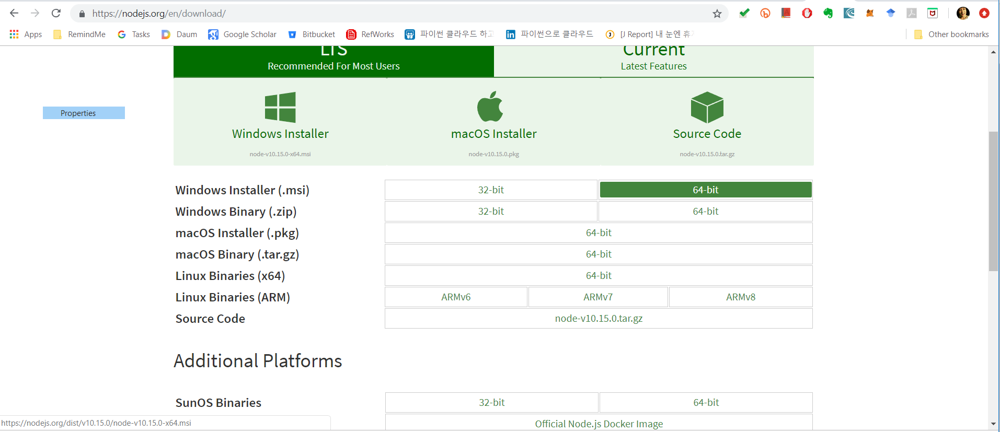
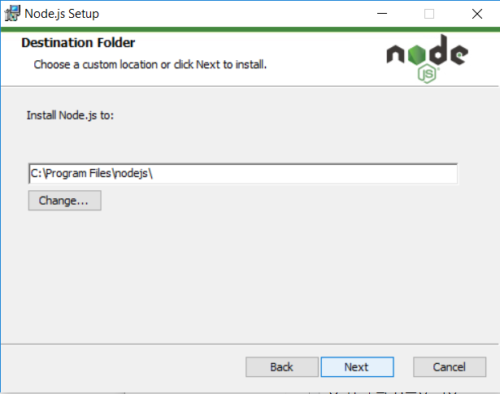
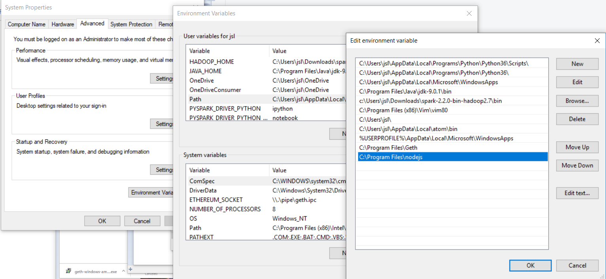
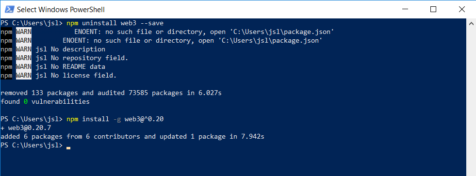
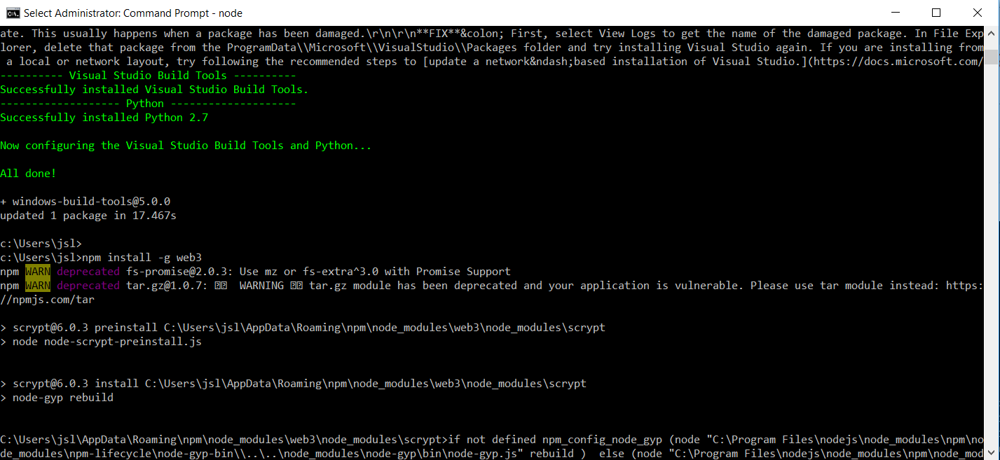
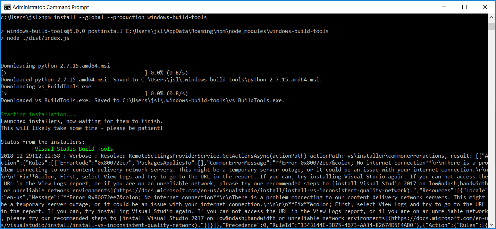

# Chapter  6. Web3 인터페이스 

블록체인은 웹에서 사용하기 위해서는 자바스크립트 web3 라이브러리가 필요하다. web3, ganache를 설치하고 이른바 웹3 페이지를 만들어 보자.

# 1. 자바스크립트 웹3

nodejs를 통해 스마트콘트랙과 인터페이스하기 위해서는 web3.js를 사용해야 한다.

```Web3.js```는 그 명칭에서 대략 무엇을 하는 것이구나라는 감이 오겠지만, 웹에서 이더리움 노드에 **HTTP, WebSocket**로 연결해서, 통신하기 위한 **자바스크립트 라이브러리**이다.

분산앱 dApp의 웹 구현을 웹디앱이라고 한다. 웹디앱에서는 블록체인에 업로드된 스마트 컨트랙의 API를 자바스크립트 ```Web3.js```에서 호출하면서 그 결과를 화면단에서 받아서 처리하게 된다.

```python
 -------------------                                 ------------
 | 웹디앱 - web3.js |  --- http, WebSocket, IPC ---  | ethereum |
 -------------------                                 ------------
```

nodejs는 자바스크립트의 서버 버전으로, 자바스크립트 문법에 따라 프로그래밍하면 된다. 자바스크립트는 **비동기** 프로그래밍을 한다. 블록체인은 그 특성 상 비동기 프로그래밍이 자연스럽다.

거래가 발생한 후 바로 인증이 되는 것이 아니다. **마이닝을 통해 작업 증명을 해야 하고, 일정 시간 후 거래가 완성**이 되는 방식이다. 따라서 그 시간 동안 프로그램의 실행을 막아놓고 마이닝이 끝나기를 기다리는 동기방식은 바람직하지 않다.

예를 들어, 투표 스마트콘트랙에 후보A에 투표를 했다고 하자. 곧 이어 그 투표수를 조회해도 변경이 없을 것이다. **바로 조회를 하게 될 경우, 마이닝으로 인해 증가된 값을 가지게 되려면 마이닝까지 시간이 걸리기** 때문이다. 마이닝을 해야 완성되므로 비동기 방식이 자연스럽다.

## 1.1 node, npm 설치

### node 설치

자신의 운영체제에 맞는 nodejs를 다운로드한다 (https://nodejs.org) 윈도우에 설치하려면 64 또는 32비트 중 자신의 컴퓨터에 맞는 설치파일을 다운로드해서 설치한다.

리눅스나 맥os를 사용하면, 단말에서 명령어를 입력하여 설치할 수 있다.
* 리눅스는 ```apt install nodejs```,
* 맥은 ```brew install nodejs```로 입력한다.
* 윈도우에서는 내려받은 msi 파일을 설치한다.



윈도우 설치 디렉토리는 ```C:\Program Files\nodejs```로 하자.



nodejs의 경로를 설정한다. nodejs를 설치한 경로를 등록하여, 명령창에서 실행이 바로 가능하도록 한다. 



### npm

**web3.js를 설치하기 위해서는 npm이 필요**하다.

npm은 노드 패키지 관리자 Node Package Manager이다. npm은 노드 패키지의 저장소 (npm registry)이고 이 저장소로부터 설치하거나 관리에 필요한 명령어를 지원한다.

윈도우에서 **npm은 ```nodejs```와 함께 이미 설치**되어 있다. 명령창에서 ```where npm```하면 알 수 있다.

리눅스는 ```apt install npm```으로 설치, ```which npm```으로 설치여부를 확인한다.

### package.json 생성

명령창을 열고, 프로젝트 디렉토리로 이동한 후 ```npm init``` 명령을 입력해보자.

```python
C:\Users\G312\Code\201711111> npm init
```

이 명령어를 입력하면 생성하려는 패키지 관련하여 package name, version, author 등의 정보를 입력하게끔 되어 있고, 그러면 ```package.json```을 생성하게 된다. ```package.json```은 패키지명, 버전, 설명 등 관련 내용을 담고 있다.

npm을 사용하다 보면, ```package-lock.json```이 생성되어 있곤 한다. 이 파일은 npm이 (1) ```node_modules``` 또는 (2) ```package.json```을 수정할 경우, 당시 의존성을 기준으로 자동으로 생성된다.

> 더 알아보기: ```package-lock.json```
> 개발자들이 동일한 ```node_module``` 트리를 생성해서 동일한 의존성에 따른 설치를 보장하는 장치이다. ```package.json```에는 버전범위가 넓게 "^1.2.3 또는 1.2.*" 으로 적혀있지만, ```package-lock.json``` 에는 정확한 버전명이 적혀있다. 예를 들어, package.json의 ^1.2.3에 따라 의존성도 결정되었다면, npm install이 동일한 버전을 선택하여 설치한다는 보장이 없다. npm update는 package-lock.json에서, npm install은 package.json에서 설치한다.

## 1.2 web3 설치

### 버전 알아보기

명령창에서 ```npm view web3@버전``` 명령어로 버전 정보를 알아보자. ```--json``` 스위치를 붙여도 된다.
```python
npm view web3
```

web3 버전 1.0의 전과 후로 문법이 크게 변경되었다. 버전은 0.20.x버전으로 머물다가, 바로 1.0으로 상향되었다. 문법이 크게 변경되어서인지 오랫동안 1.0.0 beta로 50회 넘게 버전 업이 되었다가, 비로서 2019년 중반 1.2.0이 발표되었다.

### 설치

npm으로 web3.js를 **프로젝트 디렉토리** ```C:\Users\jsl\Code\20171111```에서 설치해보자. 필요한 라이브러리를 설치하는 명령어는 ```npm install```이고, 버전을 명시하지 않으면 최신을 설치한다. 설치 디렉토리 아래 ```node_modules```이 생성된다.
```python
npm install web3
```

web3 1.0 이전의 버전은 예를 들어 ```web3.eth.accounts```하면 계정을 바로 조회하기 때문에 비동기를 하거나 말거나 신경쓰지 않아도 된다. 이런 프로그래밍의 간편성때문에 버전 1.0 이상을 사용하기 주저한다면, 이미 설치되었던 1.0을 제거하고, 하위 버전을 명시하여 ```npm install <package>@<version>```으로 한다.

다음과 같이 ``` @0.20``` 버전을 명시하고, 해당 버전의 최신버전으로 설치하자.
```python
npm install -g web3@^0.20
```




설치는 전역으로 설치하거나 특정 사용자 권한으로 설치할 수 있다. 전역으로 설치할 때는 ```-g``` 스위치를 넣어주고, 이를 생략하면 사용자 권한으로 설치하게 된다. ```package.json```에 기록된 패키지의 의존성이 갱신되어야 하는데 ```--save``` 옵션으로 해준다. ```--save```는 생략해도 기본 옵션으로 처리된다.



> 더 알아보기: **gyp 오류**

> gyp는 C 또는 C++ 언어로 씌여진 nodejs로 만든 모듈을 컴파일하는 명령어 도구이다. 오류의 원인이 하나가 아니라서 몇 가지 시도를 해봐야 한다.
> (1) 재설치: 의존성으로 인해서 문제가 될 수 있으니 처음부터 재설치해본다.
```
rm -rf node_modules  # 재설치하기 위해서 기존 설치분을 삭제
rm -rf package-lock.json
npm cache clean --force # cache에 저장되어 있는 것도 깨끗하게 지움
npm -i ---> 설치          # package.json으로부터 설치
```

> (2) 버전의 문제: 버전이 높은 경우, 오류가 발생할 수 있다.
Truffle이 npm < 7인 경우 작동한다고 한다 (Ganache는 Truffle의 일부)
그래서 npm 버전을 낮추도록 한다 (npm 10.x.x까지 npm 6이 설치된다.)
```
npm install -g npm@6
```

이런 문제는 node로 인해 발생할 수 있으니, node 최신버전을 삭제한 후 버전을 14.x.x (또는 14.17.0)으로 내려서 설치해서 성공한 경우도 있다.

> (3) 윈도우 빌드 도구: 
버전에 따라 ```windows-build-tools```를 설치가 필요하다는 오류 메시지가 뜨면.
다음과 같이 설치하자.
```python
npm install --global --production windows-build-tools (관리자 권한으로)
npm install -g node-gyp
node-gyp configure --msvs_version=2015
npm install web3@^1.0.0-beta.36 # 그리고 필요한 모듈을 설치하면 된다.
```

> (4) Python 오류: gyp오류가 뜨면서, python 오류라고 하면 이를 설정할 필요가 있다.
npm은 이 python 버전 정보를 node-gyp를 실행할 떄 넘겨준다.
```python
npm install --python=python2.7 (설치된 버전을 적어준다)
또는
npm config set python /path/to/executable/python2.7 (절대경로를 적어준다)
```

nodejs 단말을 열어서 실행한다.



### 설치 확인

라이브러리가 설치 되었는지 확인하기 위해서 ```npm list```하면 패키지명, 버전을 출력한다. 명령창의 프로젝트 디렉토리에서 하면 자신이 설치한 목록을 출력한다.

```python
C:\Users\jsl\Code\201711111>npm list --depth=0  (글로벌을 보려면 -g를 넣는다 npm -g list --depth=0)
201711111@1.0.0 C:\Users\jsl\Code\201711111)
+-- @openzeppelin/contracts@4.5.0
+-- ganache@7.0.3 설치되어 있는 ganache, 버전정보를 출력
`-- web3@1.2.6    설치되어 있는 web3, 버전정보를 출력
```

> npm **ERR! extraneous**
> 패키지가 설치되었지만 package.json에 등록이 되지 않았다는 의미이다. 따라서 무시하고 문제없이 사용하면 된다.

### web3 테스트 실행

네트워크에 연결하려면 geth가 실행되고 있어야 한다. 여기서는 버전만 확인해 본다. 대소문자 web3, Web3에 주의한다.

아래 ```> ```는 nodejs 프롬프트이다. geth 콘솔프롬프트와 생김새가 동일하다. 어느 프롬프트에서 하는지 잘 분별해서 하기로 하자.

```python
C:\Users\jsl\Code\201711111>node
> var Web3=require('web3');
> Web3.version
'1.2.6'
```

```Web3.modules.```라고 적고 <TAB>을 누르면, 제공되는 API가 출력된다. 뒷 부분에 모듈 Eth, Personal, Net, Shh 등이 출력되고 있다.
```
> Web3.modules.<TAB>
Web3.modules.__defineGetter__      Web3.modules.__defineSetter__      Web3.modules.__lookupGetter__      Web3.modules.__lookupSetter__
Web3.modules.__proto__             Web3.modules.constructor           Web3.modules.hasOwnProperty        Web3.modules.isPrototypeOf
Web3.modules.propertyIsEnumerable  Web3.modules.toLocaleString        Web3.modules.toString              Web3.modules.valueOf

Web3.modules.Bzz                   Web3.modules.Eth                   Web3.modules.Net                   Web3.modules.Personal
Web3.modules.Shh
```

<삭제?>


## 1.3 ganache 설치

지금까지 node, npm, web3를 설치해 오고 있다. 이번에는 ganache를 설치하자.

뭔 설치를 또 한다고? 그냥 geth를 쓰면 안되냐고? 물론 된다! 그러나 편리하고 효율적이다. 

ganache는 마이닝을 할 필요가 없어서 편리하다. 그래서 geth 대신 사용하자는 것이다. 뿐만 아니라, 계정을 만들지 않아도 되고 기본으로 rpc, webSocket을 설정없이 사용하기 때문에 보다 편리하다.

ganache는 이더리움 geth의 테스트용 TestRPC, 즉 geth를 대신해서 테스트하는 용도로 쓰게 된다. 버전 7.0부터는 ganache-core와 ganache-cli가 ganache로 병합되었다. 그러나 ganache-cli 별칭은 그대로 존재한다.

```python
C:\Users\jsl\Code\20171111> npm install ganache
```

설치하고 나서, ganache를 띄워보자. 간단하게 포트만 8345로 설정하자. 기본 8545는 geth에서 사용하므로 다른 포트를 사용한다.

아래 부분에 계정 10개, 잔고를 무려 100 Ether를 채워주고 있다. 계정을 만들거나 충전할 필요 없이, 나중에 gas를 지급하거나, 입출금에 사용하면 된다. 주의! ganache를 띄울 때마다 계정은 모두 삭제되고 새로 만들어 제공된다.

```python
C:\Users\jsl\Code\20171111> ganache -p 8345
Ganache CLI v6.3.0 (ganache-core: 2.4.0)

Available Accounts
==================
(0) 0xdc3f9fd9b1205bb854e5a8bb287816bf3e9fbdf6 (~100 ETH)
(1) 0x6d814bcd9060d1998c6d43fe01f919c16e0cf667 (~100 ETH)
(2) 0x6ee93ca4837d1ab240a572b9b0003e28c91985f0 (~100 ETH)
...생략...
(9) 0xfc4aa1584398e0eb77a8a4154fed71761ba5534e (~100 ETH)
...생략...
Listening on 127.0.0.1:8345
```

<삭제?>


## 문제 6-1: ganache  접속

### 설정하고 ganache 띄우기

앞서 geth 사설망을 개설한 바 있다. geth 대신 ganache를 설정하고 실행해보자.

ganache에서는 기본으로 설정되어 있기 때문에, 복잡하게 보이는 http, ws 등의 설정은 하지 않아도 된다. 대폭 줄여서 하고, geth와 같이 파일에 저장하여 일괄 실행하자. 다음과 같이 IP 주소를 적고, 포트를 8345로 해서 접속한다.

ganache-cli 또는 ganache로 적어 주어도 된다. 사용자 권한을 전역 global으로 설치했다면, 앞의 호출 경로를 적지않아도 된다. 파일명은 운영체제에 따라 윈도우 배치파일확장자 .bat 리눅스 쉘확장자 .sh를 적어서 저장한다.

```python
[파일:  _ganacheNow.bat 또는 _ganacheNow.sh]
node_modules\.bin\ganache-cli --host "127.0.0.1" --port "8345"
```

### geth attach

그리고 명령창을 하나 더 열어 접속을 한다. 

앞서 사설망 연결했던 것을 기억해서, geth attach http://localhost:8345 로 접속한다 (또는 http://127.0.0.1:8345). 명령어는 앞서 geth와 비교해서 차이가 없다.

<삭제?>


그러면 백그라운드 ganache에 접속을 하며 프롬프트가 출력된다.  ganache 프롬프트에서는 geth에서 배웠던 명령어를 그대로 적으면 된다.

```python
C:\Users\jsl\Code\201711111>geth attach http://localhost:8345
Welcome to the Geth JavaScript console!

instance: Ganache/v7.0.3/EthereumJS TestRPC/v7.0.3/ethereum-js
coinbase: 0x0000000000000000000000000000000000000000
at block: 0 (Thu, 29 Sep 2022 14:16:15 KST)
 modules: eth:1.0 evm:1.0 net:1.0 personal:1.0 rpc:1.0 web3:1.0

>
```

주의하자. 프롬프트 ```> ```를 보면 geth와 동일하다. 분명하게 말하면 ganache에 접속된 geth 콘솔의 프롬프트이라서, 내용적으로는 서로 완전히 다르다.

여기에서 계정을 출력해보자. 아래와 같이 명령어를 실행하고 나면, 백그라운드의 ganache 로그를 관찰하자. 최초 접속을 하거나 그 이후 어떤 명령을 실행하게 되면, 반응하는 로그가 출력이 된다.

```
> eth.accounts       (1)
["0x83e790081f4117befe83d35bcdec772e066f675d", "0x4c598aa8afea968bfd45ded00879085e6f862c3b", ...생략..., "0x61ee7299a12b0874cafb2281149143b836c42122"]

> web3.eth.accounts   (2)
["0x83e790081f4117befe83d35bcdec772e066f675d", "0x4c598aa8afea968bfd45ded00879085e6f862c3b", ...생략..., "0x61ee7299a12b0874cafb2281149143b836c42122"]
>
```

위 명령어(1)로 하거나, 명령어(2)로 해도 문제가 없다. 명령어를 잘 살펴보면, (2)는 web3로 시작한다. web3에서 제공하는 API를 사용하고 있다. 웹에서 인터페이스하기 위해서는 web3 API를 사용해야 한다.

그래서 node가 필요하다. 자바스크립트 문법으로 코딩해야 웹에 바로 적용할 수 있기 때문이다.

# 2. 웹에서 블록체인에 연결

## 2.1 node 시작하기

앞서 node가 설치되었는지 확인하기 위해 열어 놓은 창이 있다면 그것을 사용하자. 또는 명령창을 하나 더 열어서 node를 시작한다. 

좀 복잡하지만, 명령창을 여러개 열어 놓고 작업하고 있다. 다른 프로그래밍 언어에서는 통합개발도구를 사용하면 그럴 필요가 없을 수 있다. 블록체인 개발에는 geth, javascript, solidity 등 멀티 언어가 필요해서, 불가피하게 명령창 콘솔에서 하고 있으니, 잘 분별해서 사용해야 한다.

앞서 web3.js를 설치한 **프로젝트 디렉토리에서 node를 실행**한다. web3가 설치된 ```node_modules```에서 인식하여 호출하기 때문이다.

```python
C:\Users\jsl\Code\201711111> node
> var Web3=require('web3')
undefined
```

node에서 컴파일을 할 필요가 있는 경우, nodejs solc 컴파일러를 설치할 수 있다. nodejs 단말을 열어서 실행한다. 우리는 앞서 설치한 solidity 또는 REMIX를 사용하게 되기 때문에 설치하지 않기로 한다.

<삭제?>


## 2.2 네트워크 연결

앞서 이더리움 노드에는 HTTP, WebSocket 또는 IPC를 통해 접속할 수 있다고 설명하였다.

여기서는 이 가운데 node에서 ganache의 HttpProvider()에 연결하고, 이를 위해 Web3 라이브러를 적용하자.
명령창에서 node를 실행하고, 노드 프롬프트 ```> ```에 다음과 같이 'web3'라이브러리를 호출하고, HTTP에 연결하자.

이 때 백그라운드에 ganache가 떠 있어야 응답을 한다.

```python
> var Web3=require('web3');
> var web3=new Web3('http://localhost:8445');   // 고정IP를 사용한다면 'localhost' 대신 그 자리에 적어준다
또는
> var web3=new Web3(new Web3.providers.HttpProvider('http://localhost:8445'));
```

## 2.2 web3.eth 모듈

다음과 같이 <TAB>을 누르면, web3.eth의 API가 출력된다. 앞서 geth에서 배웠던 eth 모듈의 함수와 크게 다르지 않다. 즉, 동일한 API가 web3를 통해서 제공되고 있을 뿐이다.

```
> web3.eth.<TAB>
```

### account 조회

먼저 계정을 출력해보자. 어떤 거래이든 지급계정이 필요하다. 계정을 읽어서 ```from``` 필드에 넣어주어야 그 계정에서 출금 결제가 되기 때문이다.

geth에서는 다음과 같이 ```eth.accounts```로 출력하면 된다.
```
> eth.accounts
["0xc8ea4c4e655f8152adc075a649aa7ec35564c7c0",...생략..., "0x6f94a3529222ad7b67305c30928df0fd2d70966d"]
```

그러나 주의하자.  지금은 node에서 하고 있다. node와 geth 콘솔의 프롬프트가 서로 동일해 헛갈릴 수 있으니, 자신이 어떤 환경에서 하고 있는지 분명히 알고 있어야 한다.

버전 1.0 이후, 주소는 ```eth.accounts[0]``` 이런 식으로 배열 인덱스로 읽어올 수 없게 되었다.
```
> web3.eth.accounts[0]
undefined
>
```

node에서 web3를 사용할 때는,  버전1.0부터는 보통 함수명에 ```get```이 붙고 있고, 자바스크립트 비동기  처리 방식의 문법을 따르고 있다.

```
> web3.eth.getAccounts()
Promise {
  <pending>,
  ...생략}
```

Web3 1.0 이상에서는 함수의 callback에 Promises를 지원하고 있다. ```then(console.log)```과 같이 결과를 출력한다.

특정 인덱스를 출력하려면 다음과 같이 한다.
```
> web3.eth.getAccounts().then(ac => { console.log(ac[0]); })
Promise {
  <pending>,
  ...생략...
> 0x83e790081F4117bEfe83d35bcDEC772e066F675D
```

### coinbase, blocknumber, 잔고, node 관련 정보 읽기

이번에는 coinbase, blocknumber, balance, nodeInfo를 출력해보자.  ganache에서는 coinbase를 정하지 않고 있어서 0으로 출력한다. ```ganache --miner.coinbase``` 스위치를 적어서 정해주어도 된다. 단 ganache는 매번 띄울 때마다 계정이 새로 주어지므로 주의한다.

또한 아래 출력에서 Pending 관련 내용은 제거하고 있다. 곧 설명을 하기로 하자.

```
> web3.eth.getCoinbase().then(console.log);
0x0000000000000000000000000000000000000000   coinbase가 정해져 있지 않으면 0으로 출력한다.
> web3.eth.getBlockNumber().then(console.log);
0
> web3.eth.getBalance('0xf2a4f09c903a0a7b3450d9d16bbca14dea36aee1').then(console.log);
0
> web3.eth.getNodeInfo().then(console.log);
Ganache/v7.0.3/EthereumJS TestRPC/v7.0.3/ethereum-js
>
```

명령어를 파일에 저장하고 일괄 실행해 보자. 물론 위에서 한 것과 같이 IP와 계정주소는 자신의 설정에 맞게 변경해 주어야 한다.

```python
[파일명: src/web3ethCommands.js]
var Web3 = require('web3');
var web3 = new Web3('http://localhost:8345');
//web3.eth.getChainId().then(console.log);
web3.eth.getAccounts(console.log);
web3.eth.getCoinbase().then(console.log);
web3.eth.getBlockNumber().then(console.log);
web3.eth.getBalance('0xf2a4f09c903a0a7b3450d9d16bbca14dea36aee1').then(console.log);
web3.eth.getNodeInfo().then(console.log);
```

결과의 출력이 의도했던 순서가 아닐 수 있다는 점에 주의하자. 비동기적 특성때문에 그렇다. 곧 설명을 하게 된다.
```python
C:\Users\jsl\Code\201711111> node src/web3ethCommands.js

    0x8078e6bc8e02e5853d3191f9b921c5aea8d7f631   10개의 계정 중 coinbase를 출력한다.
    null [ '0x8078e6Bc8e02e5853D3191f9b921C5aEA8D7F631',
      '0x2371f0A50b4E63ED38063Ca4aE42E0Ad43965330',
      '0xCC16c60a1fb054d2594aD06c6f8323AFAD729065',
      '0x3b84FEb6A90Ae6934ae40cD21cD936f5876225Ea',
      '0x220780a0F17eE76d1c84a3EBc0A11664E9aF0D71',
      '0xdee208c40aD39394B1D3488917eEE5F4a09f6C08',
      '0xB207508510652d7B47DC0386dD6D90aCA3010A27',
      '0x85fD4841330BE7301fDF4e746aa349fb9f90E73D',
      '0x108c2A1Ee171608FaB937897038dcf631db973A0',
      '0xCE40E2396fafA297aDC4107c5968513f58e4C1FD' ]
    11    현재의 블록 번호를 출력한다.
    0     인식할 수 없는 계정의 잔고는 0으로 출력한다. 
    EthereumJS TestRPC/v2.10.2/ethereum-js  노드정보를 출력한다.
```

### personal 모듈

web3.eth 아래 하위 personal 모듈이 제공된다. 다음과 같이 <TAB>을 누르면 볼 수 있는데, 계정관련 ```web3.eth.personal.lockAccount```, ```web3.eth.personal.unlockAccount```
거래관련 ```web3.eth.personal.sendTransaction```, ```web3.eth.personal.signTransaction``` 등의 함수를 볼 수 있다.

```
> web3.eth.personal.<TAB>
....생략...
web3.eth.personal.currentProvider       web3.eth.personal.defaultAccount        web3.eth.personal.defaultBlock
web3.eth.personal.ecRecover             web3.eth.personal.extend                web3.eth.personal.getAccounts
web3.eth.personal.givenProvider         web3.eth.personal.importRawKey          web3.eth.personal.lockAccount
web3.eth.personal.net                   web3.eth.personal.newAccount            web3.eth.personal.providers
web3.eth.personal.sendTransaction       web3.eth.personal.setProvider           web3.eth.personal.sign
web3.eth.personal.signTransaction       web3.eth.personal.unlockAccount
```

## 2.3 비동기 함수의 이해: getAccounts() 사례

### account 저장

계정 0번째는 coinbase이므로, 즉 지급계정이다. 계정주소는 거래가 발생할 때마다 필요한 정보이므로 하드코딩하기 보다는 변수에 저장해 놓고 사용하면 편리하다. 왜 필요한지는 이쯤이면 알고 있겠지만, 거래를 생성할 때 그 계좌번호를 넣어주어야 하므로 저장해 놓아야 한다.

```python
> var ac = web3.eth.getAccounts().then(ac => { console.log(ac[0]); })
undefined
> console.log(ac)
Promise {
  undefined,
  ...
  }
undefined 저장이 되지 않았다는 의미이다.
>
```

getAccounts() 함수가 비동기적으로 실행되기 때문에 저장이 되지 않고 있다.

잘 이해가 가지 않는가? 아직 실행이 완성되지 않았고, 그래서 대기해야 하고 그 정보는 대기가 끝나야 저장된다는 것이다.

계정주소를 전역변수에 저장해보자. 아래 프로그램의 줄4, 5의 문법이 좀 까다롭기 때문에 설명을 해보자.
- 줄 4의 my=[] 배열을 선언한다.
- 줄 5의 ```web3.eth.getAccounts(function(err, res) { for (x in res) { my.push(res[x]) } } )```는 조금 복잡하다. 반복문으로 my 배열에 하나씩 계정 주소를 저장하는 작업을 하고 있다.
	- callback함수 ```function(err, res)``` 의 인자는 ```err```, ```res```를 적고 있다. 이 인자는 어디서 튀어나온 것일까? 하나씩 보자. ```Error First```, 즉 첫 자리에는 발생 오류가 차지하고, 함수 ```getAccounts()```의 실제 결과는 ```res```에 저장이 된다.
	- 그 res가 반복문에 쓰이고 있다. 배열에 저장하는 ```push()```함수로 하나씩 저장하고 있다.

이제 명령문을 파일에 저장하고 일괄 실행해 보자.

```python
[파일명: src/web3accounts.js]
var Web3 = require('web3');
var web3 = new Web3('http://localhost:8345');
web3.eth.getAccounts(function(err,res) { console.log("(1) accounts: " + res); } );
my=[]
web3.eth.getAccounts(function(err, res) { for (x in res) { my.push(res[x]) } } );
console.log("(2) accounts from array: " + my[0]);
```

저장한 파일을 프로젝트 디렉토리에서 실행해보자.
```python
C:\Users\jsl\Code\201711111> node src/web3accounts.js

    (2) accounts from array: undefined
    (1) accounts: 0x8078e6Bc8e02e5853D3191f9b921C5aEA8D7F631,0x2371f0A50b4E63ED38063Ca4aE42E0Ad43965330,0xCC16c60a1fb054d2594aD06c6f8323AFAD729065,0x3b84FEb6A90Ae6934ae40cD21cD936f5876225Ea,0x220780a0F17eE76d1c84a3EBc0A11664E9aF0D71,0xdee208c40aD39394B1D3488917eEE5F4a09f6C08,0xB207508510652d7B47DC0386dD6D90aCA3010A27,0x85fD4841330BE7301fDF4e746aa349fb9f90E73D,0x108c2A1Ee171608FaB937897038dcf631db973A0,0xCE40E2396fafA297aDC4107c5968513f58e4C1FD
```

결과를 보면, **출력의 순서**가 바뀌어 있다.

비동기 명령문은 앞에 있더라도, 먼저 실행이 된다는 보장이 없다. 명령문 (2)는 undefined 출력이 되고 있는데, 출력하려는 배열의 데이터를 push로 저장하는 것이 먼저 실행이 되지 않는 **비동기적** 특성때문이다.

### 비동기 함수의 Promise

위 프로그램의 줄6의 출력은 ```(2) accounts from array: undefined```이다. 실행되었어도 왜 전역변수 account0이 ```undefined```일까?

일반적인 프로그래밍이라면 이해할 수 없는 결과이다. 저장이 되지 않은 이유는 비동기적 특성때문에 Promise가 반환되기 때문이다.

```promise```는 결과 값이 지연되는 경우의 약속코드이고, ```then()``` 함수로 성공인 경우, 실패인 경우로 약속코드의 결과 값을 출력할 수 있다.

> **자바스크립트 Promise**

> 비동기 함수를 처리하는 패턴으로, **결과 값을 지금이 아니고, 약속을 하여 처리에 필요한 시간이 경과한 후 반환**하게 된다. 약속은 아직 완료되지 않은 실행을 의미하며, ```fulfilled```, ```rejected```, ```pending``` 또는 ```settled (fulfilled 혹은 rejected)```이 될 수 있다.

아래 코드를 보자.
* ```doPromise```은 ```promise```의 인자는 성공에 해당하는 ```myResolve``` 또는 실패에 해당하는 ```myReject```를 가진다.
* 이 값은 ```doPromise```의 연결 함수 ```then()``` 함수의 인자 ```my```로 넘겨가게 된다. ```err```인 경우에 callback으로 처리할 수 있다.

```python
[파일명: src/promiseThen.js]
var doPromise = new Promise(function(myResolve, myReject) {
    myResolve(123);  //when successful, returns 123
    //myReject("Rejected"); //when error
});

doPromise.then(function(my){
        console.log("RETURNED: "+my);
    }, function(err) {
        console.log("ERROR: "+err);
    });
```

그리고 실행해 보자. 코드에서 성공인 경우에 실행되는 ```myResolve(123)``` 또는 ```myReject("Rejected")```를 도움말처리 comment out를 해서 실행해보자. 이렇게 연습을 해보면 Promise, then코드를 좀 더 잘 이해하게 될 것이다.

```python
C:\Users\jsl\Code\201711111> node src/promiseThen.js
RETURNED: 123  호출을 myResolve(123)에서 하게 하니까, 123이 출력된다. 호출을 myReject("Rejected")로 해보자.
```

promise를 3으로 결과 값을 만들고 then() 함수로 보낸다. 연이어 10을 곱해서 다음 then()으로 보낸다.
결과가 하나씩 순서대로 출력되고 있다.


```python
[파일명: src/promiseThen1.js]
new Promise(function(resolve, reject) {
    resolve(3)
}).then(function(res) {
    console.log("3 is expected..."+res); //3
    return res * 10;
}).then(function(res) {
    console.log("30 is expected..."+res); //30 as multiplied by 10 on 2 lines above
    return res * 10;
}).then(function(res) {
    console.log("300 is expected..."+res); //300
});
```

일괄실행해보자.

```python
C:\Users\jsl\Code\201711111> node src/promiseThen1.js

    3 is expected...3
    30 is expected...30
    300 is expected...300
```

### 비동기 함수의 async/await

비동기 함수는 Promise를 반환한다. 비동기이므로 바로 값을 반환하지 않고 일단 약속만 돌려주는 것이다. Promise가 성공적으로 완료되면 결과 값이 반환되고, 그렇지 못하는 경우에는 예외를 발생하거나 오류가 발생하여 반환된다.

**await**는 **async 함수의 실행을 promise가 완결할 때까지 (fulfilled 또는 rejected) 중지**하고, promoise가 완료되는 경우 그 실행을 재개하고 그 결과 값을 받게된다 (성공인 경우 결과 값, rejected이면 거절된 값). **await 함수는 async 함수에서만** 쓰이고, 전역으로는 쓰일 수 없다.

async/await를 사용하면, await가 결과가 나올 때까지 대기상태로 있기 때문에 **```.then```을 사용하지 않아도 된다**.
또한 **try..catch문**을 (```.catch``` 구문을 사용하기 보다는) 쓰면 편리하다.


```python
[파일명: src/asyncAwait.js]
async function hello() {
    await 1000;
    return "hello";
}
hello().then(console.log);
```

일괄실행해보자. await를 1000ms만큼 깜빡 정도 대기 후, ```hello```가 출력된다.

```python
C:\Users\jsl\Code\201711111> node src/asyncAwait.js
    hello
```

### 비동기적 getAccounts 실행

먼 길을 돌아왔다. 이제 비로서 계정정보는 함수내에서 구해서 사용하면 된다. 우선은 하드코딩해서 사용하고, 나중에 다음과 같이 함수내에서 계정정보를 받아와서 프로그래밍하자.

```python
[파일명: src/web3account0.js]
var Web3 = require('web3');
var web3 = new Web3('http://117.16.44.45:8345');
var account0;
async function getAccount0() {
    accounts = await web3.eth.getAccounts();
    account0=accounts[0];
    console.log("local account0: " + account0);
}
getAccount0()
console.log("global account0: " + account0);
```

저장된 파일을 실행한다. 그럼에도 불구하고 비동기적 특성으로 전역변수에 저장은 되지 않는다. async 함수에서 계정을 조회하고 사용하도록 하자. 나중에 그렇게 사용하게 된다.

```python
C:\Users\jsl\Code\201711111> node src/web3account0.js

    global account0: undefined
    local account0: 0xbdC3f3ddBd068E0e739b926aaA527BF1D1Eb7EF0
```

## 2.3 web3.utils 모듈

```randomHex()```는 32바이트 무작위 hex를 생성한다. 64자리 문자열이 출력된다.
```keccak256()```는 입력의 keccak256을 계산한다.
```isAddress()```는 입력이 이더리움 주소인지 확인한다.
```utf8ToHex()```는 utf8 문자열을 hex로 변환한다.
```toWei()``` Wei로 변환한다.

```console.log()```로 출력한다.


```python
[파일명: src/web3utils.js]
var Web3 = require('web3');
var web3 = new Web3('http://localhosst:8345');
console.log("random hex: ", web3.utils.randomHex(32));    //generate random 32 byte hex
console.log("234 hash: ", web3.utils.keccak256('234'));  //calculate keccak256 for '234'
console.log("is address?: ",web3.utils.isAddress('0xf2a4f09c903a0a7b3450d9d16bbca14dea36aee1'));  //check if the input is a valid address
console.log("안녕 in Hex: "+web3.utils.utf8ToHex('안녕'));
console.log("wei of 1 ether: "+web3.utils.toWei('1', 'ether'));
```

console.log() 함수에서 한글이 깨지는 것은 주피터노트북에서 유니코드를 지원하지 않아서 발생하는 현상이다. 명령창에서 유니코드를 지원한다면 깨짐 없이 출력된다.

```python
C:\Users\jsl\Code\201711111>node src\web3utils.js
random hex:  0x7cf571f949a30e1dd290428bfde58d69aab57c320be8b4048e3539b24402a0ec
234 hash:  0xc1912fee45d61c87cc5ea59dae311904cd86b84fee17cc96966216f811ce6a79
is address?:  true
안녕 in Hex: 0xec9588eb8595
wei of 1 ether: 1000000000000000000
```

# 3. Web3 페이지

## HTML 작성
 
간단한 Web3 페이지를 만들어보자.

잠깐 생각해 보자. 지금까지 우리가 알고 있는 웹은 서버가 있기 마련이다. 웹페이지에서 버튼을 누르거나 클릭을 하거나 서비스를 요청하고, 그 요청을 받아 처리하는 중앙 서버가 있다.

우리는 일반적인 웹페이지가 아니라는 점을 분명히 하자. 블록체인에 결과를 받아오는, 그러니까 블록체인이 서버가 되는 웹페이지를 만든다. 이런 페이지를 Web3로 만든다.

프로젝트 디렉토리 아래 scripts 폴더를 만든다. html을 편집기를 이용해서, 파일을 scripts폴더에 저장한다.


```python
[파일명: scripts/simpleCoinbase.html]
<!doctype>
<html>
<head>
<script src="https://cdn.jsdelivr.net/npm/web3@1.2.5/dist/web3.min.js"></script>
<!-- script src="https://cdn.jsdelivr.net/npm/web3@0.20.5/dist/web3.min.js"></script -->
<script type="text/javascript">
    //var Web3 = require('web3');  //can be removed
    var web3 = new Web3(new Web3.providers.HttpProvider("http://localhost:8345"));

    function displayCoinbase() {
        var web3version = web3.version;  //web3.version.api
        //web3@0.20.x
        //document.getElementById('web3ver').innerText = 'web3 version 0.20.x: '+web3version.api;
        //document.getElementById('web3coinbase').innerText = 'coinbase: ' + web3.eth.coinbase;
        //web3@1.2.x
        document.getElementById('web3ver').innerText = 'web3 version: '+web3version;
        web3.eth.getCoinbase().then(function(coin) {
            document.getElementById('web3coinbase').innerText = 'coinbase: ' + coin;
            });
    }
</script>
</head>
<body>
    <h1>Hello</h1>
    <button type="button" onClick="displayCoinbase();">Display Coinbase</button>
    <div></div>
    <div id="web3ver"></div>
    <div id="web3coinbase"></div>
</body>
</html>
```

## 서버 올리기

HTML 코딩이 되었으면 웹서버를 띄운다.

잠깐! 블록체인은 서버가 필요없는 serverless 환경이라고 강조하지 않았던가? 맞다. 서버가 필요없다. 그렇다면 웹서버는 왜 필요한가? 웹페이지를 띄우기 위해 필요하다. 띄우고 나서, 웹페이지에서의 호출하는 서비스는 블록체인에서 제공된다.

포트번호는 의도적으로 8045을 사용한다. 8000번은 누구나 쉽게 접근가능하고, Python 서버는 가벼운 대신 보안을 통제할 수 없으므로 잠깐 사용하는 시간에도, 매우 희박한 확률이겠지만, 문제가 될 수 있다.

명령창을 열어, Python 3.x 버전에서는 ```python3 -m http.server 8045 --bind xxx.xxx.xxx.xxx```로 웹서버를 띄운다.

```python
C:\Users\jsl\Code\201711111>python -m http.server 8045
Serving HTTP on 0.0.0.0 port 8045 (http://0.0.0.0:8045/) ...
127.0.0.1 - - [30/Apr/2020 06:38:09] "GET / HTTP/1.1" 200 -
```

## Web3 페이지 열기

다음으로 웹브라우저에서 URL을 넣어서 띄운다.

url은 호스트명, 포트번호, 그 다음에 파일경로는 웹서버를 띄운 프로젝트 디렉토리를 기준으로 ```http://<url>:<port>/<경로/파일명>``` 적어준다.

브라우저 주소창에 로컬호스트, 포트 8045, 프로젝트기준으로 ```scripts/simpleCoinbase.html```을 적고 <Enter> 해보자.
```python
http://localhost:8045/scripts/simpleCoinbase.html
```

## 연습문제: 이체

* ganache를 백그라운드로 띄우고, node에서 연결하여, coinbase주소를 출력하세요.
* 위 문제를 geth를 띄우고 실행해보세요. geth에서의 coinbase를 출력하세요.
* ganache의 coinbase에서 geth의 coinbase로 1 ether를 송금해 보세요. 송금 성공이면 잔고변화를 출력하고, 실패이면 그 이유를 간단히 설명하세요.


### ```async/await``` 함수

```getCoinbase()```, ```getBalance()```는 비동기함수라서 ```await```를 사용하고, ```getCoinbaseBalance()```를 ```async```로 선언하였다. 그 결과는 별로 도움이 되지 않는다. coinbase를 획득하지 못해서 ```undefined``` 오류가 발생하고 있다.


```python
[파일명: src/getAccount0.js>
var Web3=require('web3');
var web3 = new Web3(new Web3.providers.HttpProvider("http://117.16.44.45:8445"))
var coinbase;
var balanceOfCoinbase;
async function getCoinbaseBalance(){
    try {
        _coinbase=await web3.eth.getCoinbase();
        _balanceOfCoinbase=await web3.eth.getBalance(_coinbase);
        coinbase=_coinbase;
        balanceOfCoinbase=_balanceOfCoinbase;
        console.log("coinbase: "+_coinbase+" balance: "+_balanceOfCoinbase);
    } catch(e) { console.error(e) }
}
getCoinbaseBalance();
console.log("<Global> coinbase: "+coinbase+" balance: "+balanceOfCoinbase);
```

실행하려면:
```python
node src/getAccount0.js

    <Global> coinbase: undefined balance: undefined
    coinbase: 0x21c704354d07f804bab01894e8b4eb4e0eba7451 balance: 65000021786999969076
```

### account, balance를 ```then()``` 함수로 구해보자.

주소를 구해보자. 주소를 먼저 구해야 getBalance()를 실행할 수 있다. 여기서도 전역변수 coinbase로 저장하지 못하고 있다.
로컬에서 출력된 주소 값을 사용하기로 하자.


```python
%%writefile src/getAccount0.js
var Web3=require('web3');
var web3 = new Web3(new Web3.providers.HttpProvider("http://117.16.44.45:8445"))
//var coinbase;
var coinbase = web3.eth.getAccounts().then(function(accounts) {
        console.log(accounts[0]);
        return accounts[0];
    });
console.log("<Global> coinbase: "+coinbase);
```

    Overwriting src/getAccount0.js


```python
!node src/getAccount0.js
```

    <Global> coinbase: [object Promise]
    0x21c704354D07f804baB01894e8B4eB4E0EBA7451


```web3.eth.getBalance()``` 함수는 promise를 반환하는 함수라서 전역변수 ```balanceOfCoinbase``로 저장할 수 없다.
결과에서 보듯이, Pending Promise가 반환될 뿐이다.
그러나 callback 함수에서는 그 결과가 올바르게 출력이 되고 있다.


```python
%%writefile src/computeBalance0.js
var Web3=require('web3');
var web3 = new Web3(new Web3.providers.HttpProvider("http://117.16.44.45:8445"));
var coinbase="0x21c704354D07f804baB01894e8B4eB4E0EBA7451";
var balanceOfCoinbase;
var balanceOfCoinbase=web3.eth.getBalance(coinbase).then(function(wei) {
        console.log("...returning "+wei);
        //balanceOfCoinbase=wei;
        return wei;
    });
console.log("<Global> coinbase: "+coinbase+" balance: "+balanceOfCoinbase);
```

    Overwriting src/computeBalance0.js


```python
!node src/computeBalance0.js
```

    <Global> coinbase: 0x21c704354D07f804baB01894e8B4eB4E0EBA7451 balance: [object Promise]
    ...returning 65000021786999969076


### ganche에서 geth로 전송

* geth
    - 0x21c704354D07f804baB01894e8B4eB4E0EBA7451
    - 65000021786999969076

* ganache
    - 0xB0dE384E3b90bB9F18E811E8b05CeEbC2d2bc20e
    - 100,000,000,000,000,000,000
    
* 금액 차이를 잘 식별하기 위해 송금액은 ```1.001```로 정한다.
* gas는 ```1,000,000```

* 송신은 ganache 8345, 수신은 geth로 한다. geth의 포트 8445 번호는 수신측이므로 적어줄 필요가 없다.
* geth는 전: 65,000,021,786,999,969,076 후: 65,000,021,786,999,969,076로 차이가 없다.
* 반면 ganche는 전: 100ETH - 후: 98.99858ETH = 1.00142만큼의 차이가 있다.

즉, ganache에서는 차감이 되지만 geth에서는 수신을 못하였다.


```python
%%writefile src/exercise6_sendFromGanacheToGeth.js
var Web3=require('web3');
var web3 = new Web3(new Web3.providers.HttpProvider("http://117.16.44.45:8345"));
var myAmount=web3.utils.toWei('1.001','ether');
web3.eth.sendTransaction({from:'0xB0dE384E3b90bB9F18E811E8b05CeEbC2d2bc20e',
                          to:'0x21c704354D07f804baB01894e8B4eB4E0EBA7451',
                          gas: 1000000,
                          value:myAmount})
```

    Overwriting src/exercise6_sendFromGanacheToGeth.js


```python
!node src/exercise6_sendFromGanacheToGeth.js
```

## 연습문제: 환전 계산

* ganache를 연결하고, 현재 coinbase의 잔고를 ether로 출력하세요.
* 현재 거래소 환전가격을 구해서 한화로 얼마인지 계산하여 출력하세요.

### wei를 ether로 변환하고 시세를 구해보자

```then()``` 함수로 promise의 결과 값을 출력할 수 있다.


```python
%%writefile src/computeBalance1.js
var Web3=require('web3');
var web3 = new Web3(new Web3.providers.HttpProvider("http://117.16.44.45:8345"))
web3.eth.getBalance("0x9c1F496cF46022dE1A584CcA68B68b4BF271Da43").then(console.log);
```

    Overwriting src/computeBalance1.js


```python
!node src/computeBalance1.js
```

    100000000000000000000


```then()``` 함수안에 앞의 ```getBalacne()``` 함수의 결과 값을 인자 wei로 받아서 출력해보자.


```python
%%writefile src/computeBalance2.js
var Web3=require('web3');
var web3 = new Web3(new Web3.providers.HttpProvider("http://117.16.44.45:8345"))
web3.eth.getBalance("0x9c1F496cF46022dE1A584CcA68B68b4BF271Da43").then(function(wei) {
        console.log(wei);
    });
```

    Overwriting src/computeBalance2.js


```python
!node src/computeBalance2.js
```

    100000000000000000000


```then()``` 함수안에 앞의 ```getBalacne()``` 함수의 결과 값을 인자 wei로 받아서 ```fromWei()``` 함수를 사용하여 ether로 and변경해보자.

**wei를 문자열**로 받아서 출력하고 있다.


```python
%%writefile src/computeBalance3.js
var Web3=require('web3');
var web3 = new Web3(new Web3.providers.HttpProvider("http://117.16.44.45:8345"))
web3.eth.getBalance("0x9c1F496cF46022dE1A584CcA68B68b4BF271Da43").then(function(wei) {
    var eth=web3.utils.fromWei(wei,'ether');
    console.log("balance in ether: "+eth);
});
```

    Overwriting src/computeBalance3.js


```python
!node src/computeBalance3.js
```

    balance in ether: 100


callback 함수에서 연산하여 결과 값을 출력하도록 한다.
강의자료를 잘 보면 답을 만들 수 있어요.
```console.log```는 화면출력이라서 변수에 저장할 수 없다.

```
web3.eth.getBalance().then(function (error, wei) {
}
```

이런 식으로 callback 함수내에서 계산을 해야 한다. callback 함수는 인자로 넘겨지고, 앞의 함수 ```getBalance()```가 실행이 된 후 실행이 된다.


```python
%%writefile src/computeBalance4.js
var Web3=require('web3');
var web3 = new Web3(new Web3.providers.HttpProvider("http://localhost:8345"))
web3.eth.getBalance("0xEb670169A5fcD2550035588A2ba3b45509703ABd", function (error, wei) {
    if (!error) {
        var balance = web3.utils.fromWei(wei, 'ether');
        console.log(balance + " ether");
        console.log("...converting into market price about 4,000,000 in Apr 2022");
        console.log(balance*4000000 + " won");
    }
});
```

    Writing src/computeBalance4.js


```python
!node src/computeBalance4.js
```

    999.99824546057343455 ether
    ...converting into market price about 4,000,000 in Apr 2022
    3999992981.8422937 won


비동기문으로 프로그램하면
- 계정주소를 가져오고 (accounts = await web3.eth.getAccounts();)
- 그 계정주소를 이용해 callback에서 then()함수 내에서 계산을 하고 있다.


```python
%%writefile src/computeBalance5.js
var Web3=require('web3');
var web3 = new Web3(new Web3.providers.HttpProvider("http://localhost:8345"))
async function getBalanceInWon() {
    accounts = await web3.eth.getAccounts();
    web3.eth.getBalance(accounts[0]).then(function (wei) {
        var balance = web3.utils.fromWei(wei, 'ether');
        console.log(balance + " ether");
        console.log("Balance with about 4000000 Won in Apr 2022: " + balance * 4000000 + "Won")
    })
}
getBalanceInWon() 
```

    Overwriting src/computeBalance5.js


```python
!node src/computeBalance5.js
```

    999.99824546057343455 ether
    Balance with about 4000000 Won in Apr 2022: 3999992981.8422937Won


## 연습문제: 웹소켓으로 blockNumber 출력

ganache에 webSocket으로 연결하고 blockNumber 출력

## 연습문제: coinbase 출력

coinbase를 출력하세요.

callback 함수로 키를 설정하여 보자. ```undefined```가 반환되고 있다.


```python
%%writefile src/getMyAddr1.js
var Web3=require('web3');
var web3 = new Web3(new Web3.providers.HttpProvider("http://117.16.44.45:8345"))
var myAddr0;
web3.eth.getAccounts().then(function(addr) {console.log(addr);});
```

    Overwriting src/getMyAddr1.js


```python
!node src/getMyAddr1.js
```

    [ '0x62ef1A3D3bD681b3dF8d8376354992455e036bbc',
      '0x458A1A0A6E9022546822F34363489303C4F44F4F',
      '0x04444910090Ff17a4bf8d949a7b163bE14984ec1',
      '0x54BB52765DCcaeaE27cc4DDf13149B899071e151',
      '0xF42474B2952e9426023575518F7DE73ed7f8d737',
      '0xA5a504Ab7553B6BF0da2dD151daB4DCa607d70d5',
      '0xB2e92fE1068682A7e5f4835082EA9eb8D08349e4',
      '0x87F6a04a0A0a177e04dC8923B4Bb0c7f5ecBaC20',
      '0x3CF008307d2C7628f4d775Aa0CD97Bf07CE1995D',
      '0x9Fc07DA622640cE6E463c5B6232FcF29BFf73F52' ]


이 프로그램을 node 창에서 하면 잘 된다.

```python
> var myAddr0;
undefined
> web3.eth.getAccounts(function(err,addr) {
...     myAddr0=addr[0];
...     console.log(addr);
... });
Promise {
  <pending>,
  domain:
   Domain {
     domain: null,
     _events: { error: [Function: debugDomainError] },
     _eventsCount: 1,
     _maxListeners: undefined,
     members: [] } }
> console.log("my address: "+myAddr0)[ '0xbA606f7d62C82d4dAE3c870627D64FA1BA85d9e9',
  '0x75Ba85de6286b4Dbf33B470a9880FF8cFa57F605',
  '0xB9a210a04d505A8DF867c828d383FC5a5C4C8E7b',
  '0x9a8463750b75705186A298210f28d97873d518c4',
  '0x9BDd85ca0cc9b7A1Ff7b33F6C8a23543C9fcC908',
  '0x3AFEBC123b6E1BB286E3A05539e7fAd6518Be34d',
  '0x30599f1Bd81654dD3F71556a3843461f18b6894a',
  '0x5190719F401534F2DE9FB5F72614EA7e798896e4',
  '0x0aF71c4209B95F288553744730721222A98391Ee',
  '0x5c84399053e26f3c89f3ABBD110Fee3729A1Bb31' ]

my address: 0xbA606f7d62C82d4dAE3c870627D64FA1BA85d9e9
```


```python
%%writefile src/getMyAddr2.js
var Web3=require('web3');
var web3 = new Web3(new Web3.providers.HttpProvider("http://117.16.44.45:8345"))
var myAddr0;
web3.eth.getAccounts(function(err,addr) {
    myAddr0=addr[0];
    console.log(addr);
});
console.log("my address: "+myAddr0)
```

    Writing src/getMyAddr2.js


```python
!node src/getMyAddr2.js
```

    my address: undefined
    [ '0xbA606f7d62C82d4dAE3c870627D64FA1BA85d9e9',
      '0x75Ba85de6286b4Dbf33B470a9880FF8cFa57F605',
      '0xB9a210a04d505A8DF867c828d383FC5a5C4C8E7b',
      '0x9a8463750b75705186A298210f28d97873d518c4',
      '0x9BDd85ca0cc9b7A1Ff7b33F6C8a23543C9fcC908',
      '0x3AFEBC123b6E1BB286E3A05539e7fAd6518Be34d',
      '0x30599f1Bd81654dD3F71556a3843461f18b6894a',
      '0x5190719F401534F2DE9FB5F72614EA7e798896e4',
      '0x0aF71c4209B95F288553744730721222A98391Ee',
      '0x5c84399053e26f3c89f3ABBD110Fee3729A1Bb31' ]


```python
```then()``` 함수로 통해 키를 설정하여 보자. ```promise```가 반환되고 있다.
```


```python
%%writefile src/getMyAddr3.js
var Web3=require('web3');
var web3 = new Web3(new Web3.providers.HttpProvider("http://117.16.44.45:8345"))
var myAddr0;
var myAddr0=web3.eth.getAccounts().then(function(addr) {
    myAddr0=addr[0];
    console.log(myAddr0);
});
console.log("my address: "+myAddr0)
```

    Writing src/getMyAddr3.js


```python
!node src/getMyAddr3.js
```

    my address: [object Promise]
    0xfA279EEA36550b831ce5734475F67e7d6eC4d607


async/await 명령어를 사용해서 해보자. 결과는 크게 다르지 않게 promise를 반환하고 있다.


```python
%%writefile src/getMyAddr4.js
var Web3=require('web3');
var web3 = new Web3(new Web3.providers.HttpProvider("http://117.16.44.45:8345"))
async function getAccount0() {
    var ac;
    try {
        ac = await web3.eth.getAccounts(function(err,addr) {
            console.log("AWAIT: "+addr)
            return addr[0];
        });
    } catch(err) {
        console.log(err);
    }
    return ac;
}
var myAddr0=getAccount0();
console.log("--After: "+myAddr0)
```

    Writing src/getMyAddr4.js


```python
!node src/getMyAddr4.js
```

    --After: [object Promise]
    AWAIT: 0xfA279EEA36550b831ce5734475F67e7d6eC4d607,0x23c9D8DE3803d4DeD9B60141aD2560F665f16312,0xD6208E4Ad42f9811C27A29ED700b1F9655ABE01e,0xD429BEd301822E678b6D36C8b58fdFD33251F056,0xc2FD7354c6CE1978e5b6F4811e18d847Be34430e,0xDdA4A65Bc14Fd481b83F19Cd1b66Ea6eCFd6213C,0xF278A37125246509f2f277891Cf987Ce8d538A4f,0x188e81105fceA8553cc448Dd33BCa22Af141555b,0x8be913Ec9D2eeB44651c4dC932eabc5951884b9a,0x2d043D39Ff885C163cCA416F91E78E3d1E50e4f6


## 연습문제

ganache 8345를 백그라운드로 띄우고, node에서 다음의 실행 결과를 출력하세요.
* (1) 주소0, 주소1 출력
* (2) 주소0, 주소1의 잔고 출력
* (3) 주소0에서 주소1로 1111 wei 전송 (callback 함수에서 전송메시지 출력) 
* (4) 해시 출력 ((3)의 callback으로 출력하지 말고, 전송 완료 후 출력)
* (5) 개스와 개스가격을 곱해서 출력
* (6) nonce 출력
* (7) 주소0과 주소1의 잔고 변화 출력 ((2)로부터 증감이 얼마나 되었는지)
* (8) 잔고의 합계를 더하는 과정 출력
* (9) 잔고의 합계 출력

출력예시
```
(1) ac0: 0xEb670...03ABd ac1: 0xF724C...9aDCE
(2) bal Of ac0: 999997530038074448552 ac1: 1000000000000000019998
(3) callback - sending ac0 -> ac1
(4) transactionHash: 0x4fe17...35c6d
(5) gas costs: 180000000000000
(6) nonce: 39
(7) bal diff1: ... bal diff2: ...
(8) adding balance
sum: 0 adding 0 bal: 999997488038074447441
sum: 999997488038074400000 adding 1 bal: 1000000000000000021109
sum: 1.9999974880380744e+21 adding 2 bal: 1000000000000000000000
sum: 2.9999974880380746e+21 adding 3 bal: 1000000000000000000000
sum: 3.9999974880380746e+21 adding 4 bal: 1000000000000000000000
sum: 4.999997488038075e+21 adding 5 bal: 1000000000000000000000
sum: 5.999997488038075e+21 adding 6 bal: 1000000000000000000000
sum: 6.999997488038075e+21 adding 7 bal: 1000000000000000000000
sum: 7.999997488038075e+21 adding 8 bal: 1000000000000000000000
sum: 8.999997488038075e+21 adding 9 bal: 1000000000000000000000
(9) balance total: 9.999997488038075e+21
```

* 참고: hashObj를 출력해서 필드명을 알아낼 수 있다.
```
{"transactionHash":"0x4fe178274c0c9b9ca7c456a0c28e9732f04eaa0ab06443596aa269ad75935c6d","transactionIndex":0,"blockNumber":40,"blockHash":"0xe733d62cabc03c6adbc4ab0f02105b46041321ca123ce994597de30281f5bb20","from":"0xeb670169a5fcd2550035588a2ba3b45509703abd","to":"0xf724cdbfcf9c94f28547b1111b3a6e3672a9adce","cumulativeGasUsed":21000,"gasUsed":21000,"contractAddress":null,"logs":[],"logsBloom":"0x00000000000000000000000000000000000000000000000000000000000000000000000000000000000000000000000000000000000000000000000000000000000000000000000000000000000000000000000000000000000000000000000000000000000000000000000000000000000000000000000000000000000000000000000000000000000000000000000000000000000000000000000000000000000000000000000000000000000000000000000000000000000000000000000000000000000000000000000000000000000000000000000000000000000000000000000000000000000000000000000000000000000000000000000000000000","status":true,"effectiveGasPrice":"0x77359400","type":"0x0"}
```
    * 참조: EIP-1559에 따르면, 적용개스가격 effective gas price는 단일 값으로 결정되는 것이 아니라, base fee (사용자가 정한 비용)에 실제 tip (사용자 추가비용) 한도 구간 내에서 결정한다.

* trObj를 출력해서 필드명을 알아낼 수 있다.
    * 여기 gas와 위 gasUsed가 서로 다르다.
```
{ hash:
   '0x4fe178274c0c9b9ca7c456a0c28e9732f04eaa0ab06443596aa269ad75935c6d',
  type: '0x0',
  nonce: 39,
  blockHash:
   '0xe733d62cabc03c6adbc4ab0f02105b46041321ca123ce994597de30281f5bb20',
  blockNumber: 40,
  transactionIndex: 0,
  from: '0xEb670169A5fcD2550035588A2ba3b45509703ABd',
  to: '0xF724CDbfCf9C94f28547b1111B3A6E3672a9aDCE',
  value: '1111',
  gas: 90000,
  gasPrice: '2000000000',
  input: '0x',
  v: '0xa95',
  r:
   '0xf95ff4e02811d19c01cfdf76dbd8657335a03ea56ede231dd5b33ac01ecf8648',
  s:
   '0x58967836bf74f09e163a99fbdd8d6888fadda4fa8687999dbff04258e5ed704f' }
```


```python
%%writefile src/sendEth.js
var Web3=require('web3');
var web3 = new Web3(new Web3.providers.HttpProvider("http://localhost:8345"))
async function sendEth() {
    //var ac;
    try {
        var ac = await web3.eth.getAccounts(function(err,addr) {
            //console.log("AWAIT: "+addr); //better to get addr ouside callback
        });
        console.log("(1) ac0: "+ac[0]+" ac1: "+ac[1]);
        var balac0 = await web3.eth.getBalance(ac[0]);
        var balac1 = await web3.eth.getBalance(ac[1]);
        console.log("(2) bal Of ac0: "+balac0+" ac1: "+balac1);

        //note: sendTranasaction() returns transactionReceipt
        var hashObj=await web3.eth.sendTransaction({from:ac[0],to:ac[1],value:1111},function(err, hash){
            console.log("(3) callback - sending ac0 -> ac1 hash: "+hash);
        });
        //console.log("hashObj: "+JSON.stringify(hashObj));
        console.log("(4) transactionHash: "+hashObj.transactionHash);
        // wonder why gasUsed, effectiveGasPrice of hasObj are different? -> trObj
        //console.log("(5) gas costs: "+hashObj.gas*hashObj.effectiveGasPrice);     
        var trObj = await web3.eth.getTransaction(hashObj.transactionHash);
        console.log("(5) gas costs: "+trObj.gas*trObj.gasPrice);
        console.log("(6) nonce: "+trObj.nonce);
        var balDiff0 = balac0 - await web3.eth.getBalance(ac[0]);
        console.log("(7) bal diff: "+balDiff0);
        //web3.eth.getTransactionReceipt(hashObj.transactionHash).then(console.log);
        //web3.shh.getPublicKey(ac[0]).then(console.log); //not working
        var sum=0;
        //web3.eth.getBalance(ac[0]).then(console.log);
        console.log("(8) adding balance");
        for(let i=0; i<ac.length; i++) {
            bal=await web3.eth.getBalance(ac[i]);
            console.log("sum: "+sum+" adding "+i + " bal: " + bal);
            sum+=parseInt(bal);
        }
        console.log("(9) balance total: "+sum);
        var tr = await web3.eth.getTransaction(hashObj.transactionHash);
        console.log(tr);
    } catch(err) {
        console.log(err);
    }
    return ac;
}
var myAddr0=sendEth();
console.log("--After: "+myAddr0)
```

    Overwriting src/sendEth.js


```python
!node src/sendEth.js
```

    --After: [object Promise]
    (1) ac0: 0xEb670169A5fcD2550035588A2ba3b45509703ABd ac1: 0xF724CDbfCf9C94f28547b1111B3A6E3672a9aDCE
    (2) bal Of ac0: 999997530038074448552 ac1: 1000000000000000019998
    (3) callback - sending ac0 -> ac1 hash: 0x4fe178274c0c9b9ca7c456a0c28e9732f04eaa0ab06443596aa269ad75935c6d
    hashObj: {"transactionHash":"0x4fe178274c0c9b9ca7c456a0c28e9732f04eaa0ab06443596aa269ad75935c6d","transactionIndex":0,"blockNumber":40,"blockHash":"0xe733d62cabc03c6adbc4ab0f02105b46041321ca123ce994597de30281f5bb20","from":"0xeb670169a5fcd2550035588a2ba3b45509703abd","to":"0xf724cdbfcf9c94f28547b1111b3a6e3672a9adce","cumulativeGasUsed":21000,"gasUsed":21000,"contractAddress":null,"logs":[],"logsBloom":"0x00000000000000000000000000000000000000000000000000000000000000000000000000000000000000000000000000000000000000000000000000000000000000000000000000000000000000000000000000000000000000000000000000000000000000000000000000000000000000000000000000000000000000000000000000000000000000000000000000000000000000000000000000000000000000000000000000000000000000000000000000000000000000000000000000000000000000000000000000000000000000000000000000000000000000000000000000000000000000000000000000000000000000000000000000000000","status":true,"effectiveGasPrice":"0x77359400","type":"0x0"}
    (4) transactionHash: 0x4fe178274c0c9b9ca7c456a0c28e9732f04eaa0ab06443596aa269ad75935c6d
    (5-1) gas costs: NaN
    (5-2) gas costs: 180000000000000
    (6) nonce: 39
    (7) bal diff: 42000000090112
    (8) adding balance
    sum: 0 adding 0 bal: 999997488038074447441
    sum: 999997488038074400000 adding 1 bal: 1000000000000000021109
    sum: 1.9999974880380744e+21 adding 2 bal: 1000000000000000000000
    sum: 2.9999974880380746e+21 adding 3 bal: 1000000000000000000000
    sum: 3.9999974880380746e+21 adding 4 bal: 1000000000000000000000
    sum: 4.999997488038075e+21 adding 5 bal: 1000000000000000000000
    sum: 5.999997488038075e+21 adding 6 bal: 1000000000000000000000
    sum: 6.999997488038075e+21 adding 7 bal: 1000000000000000000000
    sum: 7.999997488038075e+21 adding 8 bal: 1000000000000000000000
    sum: 8.999997488038075e+21 adding 9 bal: 1000000000000000000000
    (9) balance total: 9.999997488038075e+21
    { hash:
       '0x4fe178274c0c9b9ca7c456a0c28e9732f04eaa0ab06443596aa269ad75935c6d',
      type: '0x0',
      nonce: 39,
      blockHash:
       '0xe733d62cabc03c6adbc4ab0f02105b46041321ca123ce994597de30281f5bb20',
      blockNumber: 40,
      transactionIndex: 0,
      from: '0xEb670169A5fcD2550035588A2ba3b45509703ABd',
      to: '0xF724CDbfCf9C94f28547b1111B3A6E3672a9aDCE',
      value: '1111',
      gas: 90000,
      gasPrice: '2000000000',
      input: '0x',
      v: '0xa95',
      r:
       '0xf95ff4e02811d19c01cfdf76dbd8657335a03ea56ede231dd5b33ac01ecf8648',
      s:
       '0x58967836bf74f09e163a99fbdd8d6888fadda4fa8687999dbff04258e5ed704f' }

